# 摘要
随着众筹平台的蓬勃发展，如何在项目上线前准确预测其能否成功，已成为平台风险管理、资源分配与发起人项目设计中的关键问题。然而，现有研究在处理众筹页面信息时存在明显的局限性：大多数模型主要聚焦于文本或图像等单一模态信息，或采用简单的多模态晚期融合方法。这类方法将不同模态视作独立的特征向量进行拼接，却忽略了项目描述区图文依序呈现、交织互动所蕴含的叙事传输效应。本研究基于叙事传输理论，创新性地在深度学习建模中引入了“内容呈现结构”这一核心维度，认为高质量的众筹叙事需在呈现顺序上具备严谨的递进逻辑，并在视觉密度上保持平衡的叙述节奏，从而降低投资者认知负荷、提升众筹绩效。

基于此，本研究将复杂的页面内容呈现结构解构为两个可量化的子维度：由图文排列顺序表征的项目叙事逻辑，以及由图文物理属性表征的视觉密度，并以此构建了基于统一序列建模范式的多模态深度学习模型 MSTC（Multimodal Sequential Transformer for Crowdfunding）。首先，利用 HTML DOM 树解析技术还原项目页面的真实物理展示顺序，并使用预训练 CLIP 模型实现跨模态语义对齐，奠定序列化输入基础。其次，在模型架构层面，通过 Transformer 编码器配合正弦位置编码显式捕捉叙事逻辑中的顺序特征，模拟投资者的线性阅读过程；同时提取文本长度与图片面积等标量属性并进行投影嵌入，量化页面浏览中的视觉密度节奏。最后，通过多路并行分支建模项目的元数据信息，将捕获的图文序列特征和元数据特征进行深度融合，实现对众筹结果的精准预测。

基于 Kickstarter 真实数据集的实验结果显示，本文提出的 MSTC 模型在准确率、F1 分数及 AUC 等核心指标上均显著优于传统的无序集合模型、卷积融合模型及晚期融合模型。消融实验进一步证实了内容呈现结构的判别价值：明确的图文顺序所体现的叙事逻辑能够提供显著的性能增益，而视觉密度属性则通过表征认知负荷，为语义信息提供了稳健的补充。本研究不仅提升了众筹预测的精度，更通过实验验证了多模态内容呈现结构在众筹领域的信号作用，实现了从“关注各模态内容语义”到“关注模态内容组织形式”的转变，为众筹项目质量评估提供了新视角。

关键词：众筹结果预测；多模态深度学习；叙事传输理论

# Abstract
With the rapid expansion of crowdfunding platforms, accurately predicting project success before launch has become a critical issue for platform risk management, resource allocation, and project design by originators. However, existing research exhibits significant limitations in processing crowdfunding page information: most models focus primarily on single-modal data, such as text or images, or employ simple late-fusion multimodal methods. These approaches treat different modalities as independent feature vectors for concatenation, thereby neglecting the narrative transportation effect inherent in the sequential presentation and interplay of text and graphics within project descriptions. Grounded in Narrative Transportation Theory, this study innovatively introduces "content presentation structure" as a core dimension in deep learning modeling. We posit that high-quality crowdfunding narratives must possess a rigorous progressive logic in their presentation order and maintain a balanced narrative rhythm in terms of visual density, thereby reducing investor cognitive load and enhancing crowdfunding performance.

Based on this premise, this research deconstructs the complex content presentation structure into two quantifiable sub-dimensions: narrative logic, represented by the arrangement order of text and images, and visual density, represented by their physical attributes. Consequently, a multimodal deep learning model, MSTC (Multimodal Sequential Transformer for Crowdfunding), is constructed based on a unified sequence modeling paradigm. First, HTML DOM tree parsing is utilized to reconstruct the authentic physical display order of the project page, while a pre-trained CLIP model is used to achieve cross-modal semantic alignment, establishing the foundation for sequential input. Second, at the architectural level, a Transformer encoder paired with sinusoidal positional encoding is employed to explicitly capture sequential features within the narrative logic, simulating the linear reading process of investors. Simultaneously, scalar attributes such as text length and image area are extracted and projected as embeddings to quantify the rhythm of visual density during page browsing. Finally, the model utilizes multi-path parallel branches to model project metadata, deeply fusing the captured multimodal sequence features with metadata features to achieve precise prediction of crowdfunding outcomes.

Experimental results based on a real-world Kickstarter dataset demonstrate that the proposed MSTC model significantly outperforms traditional unordered set models, convolutional fusion models, and late-fusion models across core metrics including Accuracy, F1-score, and AUC. Ablation studies further confirm the discriminative value of the content presentation structure: the narrative logic reflected in a clear text-image sequence provides substantial performance gains, while visual density attributes offer a robust complement to semantic information by characterizing cognitive load. This research not only improves the precision of crowdfunding prediction but also empirically validates the signaling role of multimodal content presentation structures. It marks a paradigm shift from "focusing on modal semantic content" to "focusing on the organizational form of modal content," providing a novel perspective for the quality assessment of crowdfunding projects.

**Keywords:** Crowdfunding success prediction; Multimodal deep learning; Narrative transportation theory 

# 第 1 章 绪论
## 1.1 选题背景和意义
随着数字经济的蓬勃发展，众筹作为一种依托互联网平台的普惠金融模式，已成为初创企业筹资、创意项目落地的重要渠道。尽管众筹行业整体规模不断扩大，但项目成功率并不高。如果能对众筹结果进行精准预测，于平台来说，可以优化资源配置，为更有可能成功的项目预留空间；于众筹发起者来说，可以主动修改项目资料，避免高额的众筹失败成本。

在众筹页面中，发起人通过文字叙述、视觉图像以及结构化的元数据来构建项目蓝图。对于投资者而言，阅读众筹页面的过程不仅是获取客观信息的过程，更是被发起人按照特定的内容呈现结构引导认知的过程。近年来，多模态深度学习在内容理解与行为预测中展现出巨大潜力，在众筹领域也有研究者进行了初步探索，从早期对元数据特征（如筹款目标、项目类型）的研究逐步转向对文本语义、图像美学及封面视频特征的挖掘。然而，现有研究在处理多模态数据时仍存在以下局限：首先，大多将文本、图像视为独立的语义集合，通过向量拼接、交叉注意力等方式进行晚期融合，忽略了图文排列顺序所构建的叙事逻辑；其次，现有的模型往往侧重于图文内容语义，却鲜有关注内容呈现的视觉密度（例如文本的冗长程度、图像的大小以及图文的交替频率等）对预测绩效的影响。

本研究通过引入统一序列建模范式，将众筹页面的内容呈现结构纳入预测框架，具有重要的理论与实践意义。在理论层面，本研究打破了传统多模态模型“重内容、轻结构”的局限。通过引入位置编码和图文物理属性进行图文序列建模，尝试挖掘良好的呈现结构带来的叙事价值，并通过实验分析了图文顺序和视觉密度（如文字长度、图片尺寸）对众筹成功性预测的增量贡献。这种理论上的探索在实践中得到了有力印证。实验结果证明，引入内容呈现结构能有效提升预测模型的准确率、F1 分数以及 AUC 等核心指标，证实了图文排列顺序与视觉密度中蕴含着以往研究忽视的判别信息。这一发现为众筹预测技术提供了新的特征工程方向，证明了在构建众筹预测系统时，不仅应关注内容语义，还应将“如何呈现”作为关键的辅助维度纳入建模范畴，从而增强模型对真实复杂场景的表征能力。对于众筹平台而言，这意味着可以构建更精准的早期筛查模型，从而优化首页流量分配机制与风险预警系统。

## 1.2 研究现状
众筹市场在展现巨大潜力的同时，也面临着低成功率的严峻挑战，这使得众筹结果预测成为平台运营者、项目发起人和投资者共同关注的核心问题。

传统的众筹预测研究主要依赖单一模态数据，尤其是项目描述、评论等文本信息，众多早期研究深入探讨了文本语义对融资结果的预测力[1-2]。然而，单一模态方法难以刻画众筹项目的多维度特性。实际上，一个成功的众筹项目除文本叙事外，往往还包含着丰富的视觉元素（项目图片、视频演示）、结构化的元数据（目标金额、持续时间）以及动态的社交信号（评论、分享、点赞）。这些多源信息之间存在着复杂的交互关系，共同影响着投资者的决策过程和项目的最终成败[3]。

多模态众筹结果预测研究的兴起，正是为了应对这一挑战。该领域旨在整合文本、图像、音频、视频、元数据等多种数据模态，通过先进的机器学习和深度学习技术，构建更加准确、鲁棒的预测模型。多模态概念源于多媒体信息处理领域，指涉及多种数据类型或媒介的信息表示。在众筹预测场景中，多模态数据主要涵盖了以下四个维度：

(1) 结构化元数据：包括目标金额、持续时间、项目类别、地理位置等。元数据特征的优势在于其明确性和可解释性，因此这类信息在绝大多数预测模型中被广泛使用[4]。

(2) 文本模态：包括项目标题、描述文本、更新内容、评论文本、发起人简介等。文本特征提取方法经历了从传统自然语言处理到深度学习的演进。早期研究采用词袋模型、TF-IDF等统计特征，随后引入Word2Vec、GloVe等词嵌入方法，当前主流方法采用BERT、RoBERTa等预训练语言模型进行文本表示学习，实现了从词频统计到深度语义挖掘的跨越 [5-6]。

(3) 视觉模态：包括项目封面图片、视频演示等。视觉特征的提取通常采用卷积神经网络（CNN），如 VGG、ResNet、EfficientNet 等预训练模型。对于视频内容，还需考虑时序特征和音频特征。研究表明，图像特征对众筹预测性能有显著提升作用，视觉内容的情感属性和专业程度是影响成功的关键因素[7-8]。

(4) 社交与动态特征：包括点赞数、分享数、评论数（包括发起人互动频率）、支持者数量、项目发起人社交网络等，反映项目的社会认同程度。然而，诸如支持者规模等动态特征仅在项目发布后随时间推移而积累，具有滞后性，难以满足发起人需要在筹备阶段进行结果预判的需求。相比之下，项目发起人的社交资产作为可以预判的静态信息，往往具有更高的挖掘价值，在相关研究中占据主导地位。

多模态众筹结果预测技术的发展经历了从传统机器学习模型向深度学习模型转型的过程。

早期众筹预测研究主要采用传统机器学习方法，包括逻辑回归、支持向量机（SVM）、随机森林、决策树等[9-11]。这些方法通常依赖人工特征工程，如从文本中提取词频、主题分布等统计特征，从元数据中提取结构化特征。然而，传统方法存在明显局限性：文本特征表达能力有限，难以捕捉语义复杂性；视觉特征几乎被忽视或简化为简单统计量；特征工程耗时耗力，泛化能力受限。为了提升预测效力，部分过渡性研究开始引入神经网络进行特征挖掘。例如，Kaminski 和 Hopp (2020) 利用 Doc2Vec 模型捕捉文本、语音转录以及视频元数据中的语义关联，并使用机器学习模型进行预测[12]。但此类研究对文本和视觉信息的利用仍停留在离散属性统计层面，尚未实现模态间的深度交互。

深度学习的引入是众筹预测技术发展的重要里程碑。研究者开始采用深度神经网络处理图像特征和文本特征，并探索多模态融合架构，标志着众筹预测技术从依赖先验知识的人工特征工程转向了数据驱动的自动表征学习时代。不同于传统方法在处理非结构化数据时面临的表达瓶颈，深度学习架构能够通过端到端的训练，从原始文本流和像素级图像中自主提炼出具有高阶语义特征的判别规律，从而更精准地刻画众筹项目的多维度吸引力。Cheng 等（2019）首次系统性地提出了基于多模态深度学习的预测模型，将文本、图像和元数据结合起来进行成功预测，奠定了当前多模态预测研究的基础[13]。此后的众多研究也证明了这类建模方法的优越性，研究者们开始在此基础上探索更为复杂的模态融合策略，例如引入交叉注意力机制、解耦学习或图神经网络等[14-16]。这一系列的研究显著提升了预测的准确率与鲁棒性，已成为目前众筹绩效预测领域的主流研究方向之一。

## 1.3 研究内容
本研究旨在构建一个基于统一序列建模范式的、关注众筹项目内容呈现结构的多模态深度学习模型，用于预测奖励型众筹项目的成功与否。为实现这一目标，研究内容涵盖了从数据构建、模型架构设计、模型训练与算法优化到实验验证的全过程。

研究工作的首要环节是基于 HTML DOM 树的多模态序列构建。对于非结构化的众筹项目描述页，其处理的重难点在于如何将网页内容转化为模型可理解的结构化序列。本研究采用爬虫技术收集了 Kickstarter 平台上 30000 余条真实项目数据，使用 HTML DOM 树解析技术提取项目描述中的文字块与图片块，并按照其在页面中真实的物理展示顺序进行排列。在此基础上，利用预训练的 CLIP 模型进行多模态图文嵌入，确保跨模态特征在语义空间的对齐，奠定跨模态交互的基础。 

在获得序列化输入后，研究重点转向统一序列模型 MSTC 的设计与实现，旨在构建一个能够深度建模内容呈现结构、并结合元数据信息进行预测的深度学习框架。该模型从多维特征的 Token 编码出发，基于 Transformer 架构实现深层跨模态交互，最终通过异构分支融合与分类头输出最终预测结果。具体内容如下：

(1) 内容块 Token 编码：模型将项目描述区建模为一系列图文交替、按序排列的内容块，每个块首先通过 Token 编码器进行表征。该编码器将含有块语义的 CLIP 嵌入向量、块类型编码（文本或图片）以及反映视觉密度的块属性（文本长度或图片大小）进行融合，形成序列化输入。为了让模型能够理解页面排列顺序，该序列在进入后续编码器前注入了固定的正弦位置编码，使模型能够识别图文出现的先后次序，从而捕捉项目发起人精心设计的叙述节奏。

(2) Transformer 序列编码器：Token 序列进入到 Transformer 序列编码器后，该模块利用多头自注意力机制（Multi-head Self-Attention）模拟读者的认知过程，实现 Token 级别的跨模态深度融合，并通过屏蔽均值池化（Masked Mean Pooling）技术，将 Token 聚合为整个项目的叙事表征向量。 

(3) 双分支异构融合架构：在图文序列之外，模型还设计了并行的元数据分支，负责提取项目元属性（如目标金额、持续时间、项目类别等）所包含的判别信息。该分支提取的特征与叙事表征向量进行拼接融合，形成全量特征空间，最终由分类头完成从高维特征到成功概率的映射，实现对项目成败的判定。

针对众筹数据分布不均以及模型在复杂环境下易产生的稳健性问题，研究继而探讨了训练与评估过程中的模型稳定性优化方案。首先，众筹数据中失败项目更多，为缓解项目类别不平衡的问题，研究使用下采样和标签平滑（Label Smoothing）策略，缓解模型对多数类样本的偏向。其次，采用权重衰减解耦的 AdamW 优化器，配合线性预热与余弦退火学习率调度，保证训练平稳收敛。之后，为提升训练和评估的稳定性，引入全局梯度裁剪防止梯度爆炸；使用指数滑动平均（EMA）技术对参数进行平滑处理，降低模型在验证集上的指标波动，从而获得泛化性能更优、评估更稳健的预测权重。最后，本文使用了基于验证集 F1-score 最大化的动态阈值寻优算法，打破传统固定分类阈值的限制，通过自动化的阈值选择机制，使其能根据实际业务需求产出更具应用价值的预测结论。 

研究的最终环节为对模型性能的系统验证。为确保模型的有效性与实用性，本研究在 Kickstarter 实际项目数据集上将本模型与一系列基线模型进行对比实验，评估指标包括准确率、AUC、F1-score等。同时，通过消融实验验证位置信息和视觉密度属性对预测精度的边际收益，验证内容呈现结构作为判别信息的有效性。 

**图 1-1 研究内容**

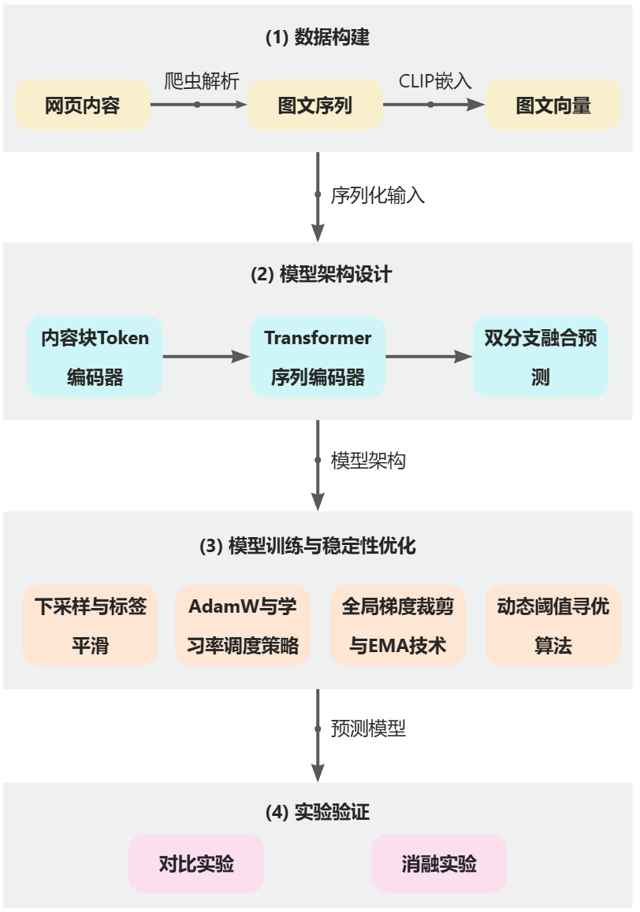

## 1.4 研究重点与创新点
本研究的核心在于探究众筹项目内容呈现逻辑与众筹能否成功之间的内在关联，不局限于分析项目的多模态内容语义，而是转向研究“项目是如何说的”。具体而言，研究重点围绕两个核心维度展开：首先是对叙事逻辑的捕捉，即通过正弦位置编码刻画图文块的先后排列顺序，研究不同的叙述节奏如何构建出差异化的说服逻辑，进而影响投资者的决策反馈；其次是视觉密度的量化，通过提取文本长度、图片大小等非语义物理属性，建模潜在投资者在页面浏览过程中的视觉节奏与认知负荷，从而探索投资者心理感受与筹资成功率之间的关系。 

基于上述研究重点，本研究在理论视角、特征工程与模型架构三个层面实现了对现有预测模型的拓展与创新：

(1) 理论视角：传统研究将众筹项目视为文本集合和图片集合的简单组合，忽略了内容布局蕴含的价值。本研究首次将分析焦点从“内容是什么”转向了“内容如何被组织和展示”。该视角不仅关注内容本身，更关注其排列顺序、节奏密度与图文交替结构如何影响投资者决策，为众筹绩效预测提供了全新的理论切入点。 

(2) 特征工程：为克服传统多模态模型中特征语义空间割裂的问题，本研究全面采用 CLIP 作为统一的图文编码器，实现了特征在本质上的跨模态语义对齐。其次，本研究量化了文本长度、图片尺寸等物理特征，并将其与语义特征进行融合，实验证明，这种融合方式能够有效捕获以往研究忽视的判别信息。

(3) 模型架构：本研究打破了传统多模态模型通过向量拼接进行晚期融合的局限，创新地采用统一序列建模，通过 Transformer 架构实现了跨模态 Token 级的深度交互。这一方法能够更真实地模拟人类浏览网页的认知逻辑，提升了模型对复杂页面信息的表征能力以及预测的准确率。

## 1.5 论文组织结构
本文共分为五章，各章节的具体内容安排如下：

第一章：绪论。阐述本研究的选题背景与研究意义，分析现有众筹预测研究现状及局限性，明确研究目标、研究内容及创新点。

第二章：相关文献综述。回顾众筹结果影响因素、多模态预测研究现状，并从多模态内容呈现理论及工程实践角度，为本研究引入叙事逻辑与视觉密度特征提供理论支撑。

第三章：模型构建。详细介绍基于统一序列建模范式的多模态深度学习模型 MSTC（Multimodal Sequential Transformer for Crowdfunding）的设计方案。

第四章：实验过程及结果分析。描述数据来源、预处理流程及实验设置。通过对比实验验证本文模型（MSTC）的优越性，并通过消融实验量化叙事逻辑与视觉密度对预测性能的贡献。

第五章：总结与展望。总结全文研究成果与主要结论，阐述本研究在理论与实践层面的贡献，并指出当前研究存在的局限性及未来可能的研究方向。 

# 第 2 章 相关文献综述
## 2.1 众筹结果影响因素研究
本文的研究目标为基于奖励的众筹市场，在该市场环境下投资者与项目方的信息不对称现象普遍存在，因此项目方披露的信息对众筹结果至关重要，投资者往往基于此进行决策。现已有大量研究从实证角度探讨项目成功的影响因素，主要涵盖项目元信息、文本内容、视觉呈现与项目互动等维度。这些研究不仅揭示了众筹结果的内在影响因素，也为预测模型中的特征选择提供了理论指导。

在以往的研究范式中，众筹页面通常被抽象为一组高维的特征向量，通过统计学检验或机器学习方法建立变量与众筹结果之间的关联。

从项目主体视角出发，项目目标金额、发起时间、项目类别等元信息在绝大多数研究中被广泛使用，在众筹绩效预测模型中发挥着基础性作用。除上述基础信息之外，既有研究多关注发起人社交资本、动态行为及历史经验对众筹结果的影响。例如，Kao 等 (2020) 研究了发起人之间的社交网络对项目投入产出比的影响，实证结果表明，项目发起人之间通过互惠和联结积累的社交资本显著优化了项目从资源投入到资金产出的转化过程[17]；互动的即时性与深度也是研究热点，李清香等 (2020) 研究发现，发起人与出资者之间的双向在线互动显著影响众筹结果，其中出资者评论的情感倾向以及发起人回复的长度均与筹资成功率正向相关[18]； 在经验积累维度，王念新等 (2020) 的研究表明，项目发起人通过过往发起项目和支持他人项目所积累的直接或间接经验显著提升了项目成功率[19]。

在项目主体信息之外，随着多媒体技术在平台中的普及，多模态信息在影响众筹结果中也发挥关键作用。 既有研究表明，多模态元素的丰富度与内容质量显著影响融资绩效。例如，Carradini 等 (2023) 研究发现，成功的众筹项目往往比失败项目使用了更多的图片、视频等非文本元素，在内容表现上具有明显优势，形成了更强的感官冲击[20]；Raab等 (2020) 考察了图片中显示的面部情绪表达如何影响资助决策，发现快乐和悲伤的面部表情能够引发共情，对投资者的资助决策有正向诱导作用[21]；Costello 等 (2022) 探讨了众筹中文本模糊性和双面性对项目融资成功可能性的影响，强调了表述清晰度在建立契约信任中的重要性[22]；封面图作为项目的第一视觉入口具有特殊影响力，Chen 等 (2023) 研究了在众筹平台上封面图像如何影响资助结果，以及对于不同类型的众筹活动影响有何不同[23]。尽管这些多模态特征在解释性研究中日益受到重视，但它们很少被系统纳入预测模型的特征工程或深度学习框架中，这构成了本文后续开展多模态融合预测研究的重要切入点。

## 2.2 众筹领域中的多模态预测研究
鉴于影响众筹结果的因素众多，且呈现出多模态并存的特征，过往预测研究已从单一模态逐步转向复杂的多模态融合范式。

早期研究多聚焦于单一模态。在文本侧，研究者在预测模型中加入项目描述、项目评论等文本信息，以提升模型的预测效果：Song 等 (2020) 使用 RWW 框架分析文本，建立了技术类众筹的预测模型[24]；Bao 等 (2022) 提出了从评论中挖掘语义特征的新框架，以改进筹款成功预测[25]。在视觉侧，视觉信息（图片、视频）对于吸引潜在支持者、传达项目理念、展示产品特性以及激发捐款意愿有着直接的影响，因此 Blanchard 等 (2023) 重点关注了视觉特征的提取，并使用机器学习方法预测众筹项目筹集到的总金额[26]。

近年来，使用多模态模型整合多维信息进行众筹结果预测成为了主流方向。其中，Cheng 等 (2019) 提出的多模态深度学习（MDL）模型是该领域的开创性工作之一[13]。该研究首次将视觉图像作为除文本和元数据之外的重要模态引入众筹预测任务中，设计了三个并行分支：顶部分支利用 One-hot 编码处理类别和筹资目标等元数据；中间分支利用预训练的 VGG16 网络提取项目描述中多张图像的深层特征；底部分支则通过词嵌入对文本进行语义编码。模型最终通过全连接层实现各模态特征的晚期融合，实验证明引入视觉信息能显著提升预测准确率，特别是在文本信息匮乏的项目中表现优异。

**图 2-1 ****MDL模型****结构参数图****（重绘自论文[13]）**

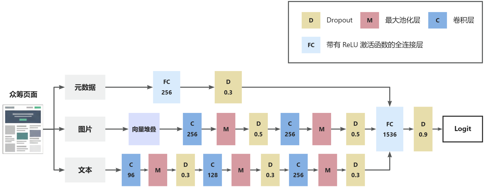

在 MDL 奠定的基础上，后续研究开始探索更精细的特征工程与多模态融合策略。Kaminski (2020) 利用文本、语音、视频元数据构建预测模型，强调语言风格与可视化演示的重要性[12]；徐琳 (2022) 整合了数值、文本和图像三种模态，并采用证据理论融合模型进行决策预测[27]；Al-Qershi 等 (2022) 深入挖掘了众筹广告中的哪些内容特征更有助于准确预测众筹成功，设计了 1368 个细粒度特征，并使用集成学习模型提升了预测的适应性[28]。

最新研究在视频模态的引入和模态交互的深度上取得了进一步突破。Tang 等 (2022) 针对众筹页面中信息含量极高的介绍视频，提出了深度交叉注意力网络（DCAN），该模型创新性地开发了跨模态交叉注意力块（Cross-Attention Block）来对齐文本描述与长视频，在有效缓解数据噪声的同时提升了跨模态交互质量[14]。Zhang 和 Lau (2024) 结合项目描述文本、音频片段和视频片段等多模态特征，通过将音视频信号转录为文本并进行晚期融合，证明了多模态协同较单一模态具有显著优势[29]。Cai 等 (2024) 提出了多模态动态图卷积网络（MDGCN），将多模态交互建模提升到了图结构层面，增强了模型捕获复杂模态关联的能力[15]。Li 等 (2025) 针对众筹场景下模态间语义关联较弱的挑战，提出了共性增强的多模态解耦框架（CAMD），通过将异构数据映射至模态不变空间与模态特定空间，并利用增强网络放大潜在的跨模态共性，实现了更为平衡且稳健的特征表示[16]。

上述研究共同推动了众筹预测从单一模态分析向复杂多模态深度交互的范式演进，极大地提升了模型的特征表征能力。然而，尽管现有模型探讨了更复杂的多模态交互结构，但仍主要关注模态内容本身的语义信息，缺乏对内容呈现方式的建模。这些方法往往把文本、图片、视频内容视为语义信息的集合，却忽略了众筹界面图文依序排布所形成的叙事逻辑，以及排版的视觉密度对潜在投资者认知负荷的影响。鉴于此，本文通过 Transformer 架构捕捉图文交替中的叙事节奏与视觉密度特征，旨在从众筹界面的内容呈现结构这一新视角提升众筹结果预测的准确度。

## 2.3 多模态内容呈现理论
众筹项目的页面浏览本质上是一个高强度的信息摄取与决策过程。出资人在面对陌生项目时，既需处理项目本身的内在复杂性，又需、应对信息呈现方式所带来的外在认知负荷。因此，项目描述区的内容呈现直接决定了信息的传递效率与用户的决策行为。

首先，视觉密度深刻影响着用户的阅读意愿。视觉密度是指在给定界面空间内信息元素（包括文本、图像、图标及装饰性元素）的集中程度。认知负荷理论指出，人类的工作记忆容量有限，视觉密度的管理本质上是对用户有限的注意力资源进行调度。如果多模态界面视觉密度过高，单位面积内的信息量（如字数、图片）超出了工作记忆的承载范围，就会引发认知过载与逃离行为[30-32]。Djamasbi 等 (2011) 的眼动追踪研究进一步证实，Web 用户倾向于 F 型扫描，高密度文本会导致视线在垂直扫描中滑落 [33]。Liang 等（2020）的研究也证明，在文本维度上，众筹项目的字数与融资成功率之间存在显著的“倒 U 型”关系 [34]。字数一旦超过某个特定阈值，过剩的信息就会转化为外在负荷，形成理解负担，反而降低了投资者的支持意愿。在此基础上，加工流畅性理论进一步解释了这一现象 [35]：文本长度、图片大小等视觉密度特征直接影响界面认知负荷，当页面呈现出较低的认知负荷时，投资者会产生更高的加工流畅性，这种轻松的心理感受往往会转化为对项目质量的直觉判断，进而提升投资意愿。这意味着众筹项目界面不应追求极端的信息堆砌，而应通过优化视觉密度来匹配投资者的认知能力。

除视觉密度等静态属性外，图文内容的排列顺序同样是决定说服效果的关键变量。研究表明，人类对信息的加工具有显著的顺序依赖性。根据 Hogarth 和 Einhorn (1992) 提出的信念修正模型 [36]，个体在接收序列信息时，会以当前信念为锚点，并根据后续信息进行调整和加权。在这种序贯加工过程中，信息的呈现顺序会直接改变权重的分配，导致相同的多模态刺激产生截然不同的判断结果。 在 Web 环境下，用户往往采取自上而下顺序浏览的信息处理模式，使得符合阅读习惯的“倒金字塔”结构及图文交替的呈现节奏能够通过优化认知路径来增强内容说服力 [37]。这种顺序效应在多个领域得到了实证：在新闻领域，Tjärnhage 等 (2023) 发现交互式图文叙事能有效维持用户注意力[38]；在电商领域，Lee 等（2019, 2020）发现图片的排列顺序会影响消费者的购买意愿 [39-40]；在广告领域，Razak 等 (2017) 指出文字和视觉元素共同构成了广告的说服过程，广告往往优先使用具有吸引力的图片抓取消费者注意力，随后再使用文字通过深入的信息披露来完成说服[41]。因此，在以 Kickstarter 为代表的众筹场景中，图文顺序所蕴含的叙事结构也不仅仅是信息披露的载体，更是决定筹资说服力的核心逻辑。

从深层心理机制看，视觉密度和排列顺序对众筹成功性的影响可以用叙事传输理论来解释：该理论指出，受众能否被叙事带入情境并产生信念偏转，高度依赖于叙事质量[42]。在众筹的多模态情境下，叙事质量具体转化为两个维度：顺序决定了叙事的方向感与逻辑自洽性，而视觉密度决定了叙事的呼吸感与情绪节奏，二者共同决定了项目内容对潜在支持者的说服效果。本文对众筹项目的内容呈现方式进行建模，旨在量化项目的“叙事传输”对众筹成功性的影响。

## 2.4 内容呈现结构建模的工程实践
鉴于内容呈现结构的重要性，多模态深度学习模型在行为预测领域已形成了较为成熟的工程化建模方案。以微软 LayoutLM 系列模型为代表的系列工作，开创性地将文本、布局坐标和视觉信息统一到同一个预训练框架中，奠定了多模态布局建模的基础[43-44]。这种布局信息的效用在多个交互场景中得到了实证：在点击率预测领域，Cui (2025) 等提出了基于扩散模型的多模态协同兴趣网络，通过建模图文在特定布局下的复杂交互与协同效应，证实了捕捉模态间的空间关联对于提升点击率预测精度的关键作用[45]；在新闻推荐领域，Chai (2025) 等发现“左图右文”的排列方式更符合人类的认知加工习惯，证实了图文出现的物理顺序与空间占位会直接干预用户的认知效率。上述研究均表明，引入布局信息是提升模型预测精度的重要途径。

这种建模趋势的背后有着深层的认知与方法论支撑。Paivio 提出的双重编码理论指出，大脑在处理图文交替信息时，文字和视觉信息是由不同系统并行加工但又相互关联的[46]。 然而，在传统深度学习中，这种多模态特征往往因模态不同、特征空间割裂而难以整合。CLIP 等预训练模型的出现，通过对比学习将不同模态映射至统一的表征空间，为双重编码理论提供了工程视角的模态间关联处理，已成为当前多模态融合的主流范式 [47]。其核心价值在于通过跨模态语义对齐，使模型能够超越单纯的特征堆砌，转而捕捉图文序列中深层的叙事逻辑。

由此审视众筹场景，虽然其页面不像复杂文档那样具有多变的二维布局，但其图文叙事序列实质上构成了特定场景下一种线性的、流式的布局结构。这种结构虽然在空间维度上进行了简化，但在逻辑维度上对众筹绩效的影响依然存在。然而，现有众筹研究大多关注模态具体内容，鲜有研究系统量化这种图文布局模式对融资绩效的影响。本文旨在填补这一空白，将上述对内容呈现结构的建模思想引入众筹领域，对众筹项目描述页面的图文序列进行建模与分析。

## 2.5 本章小结
本章从众筹结果影响因素、预测模型、内容呈现理论及工程实践四个维度，对众筹领域的既有研究进行了全面回顾。

在影响因素层面，既有研究表明，奖励类众筹的结果受项目元属性（如目标金额、类别）、发起人社交资本等项目主体信息的影响。此外，随着多媒体内容的普及，已有大量研究证实图片、视频及文本等多模态因素在感官冲击与信任建立中发挥了重要作用。

基于对影响因素的研究，多模态众筹预测技术已实现从单一模态分析向深度多模态融合的转型。近期研究通过引入交叉注意力机制、图卷积网络及模态解耦框架，不断提升了模型对多模态数据的表征能力。然而现有研究大多关注内容语义本身，尚未对多模态内容的呈现方式进行建模。

为探讨多模态内容呈现方式影响众筹结果的机理，本章引入了认知负荷理论、加工流畅性理论及叙事传输理论在界面浏览中的应用。研究发现，过高的视觉密度会导致阅读者认知过载，而符合认知规律的线性叙事顺序则能优化权重的分配并增强内容的说服力。这为本文进行叙事逻辑和视觉密度的量化提供了理论依据。

最后，本章调研了目前内容呈现结构建模的工程化实践方案。借鉴 LayoutLM 与 CLIP 等领先的布局建模与多模态预训练范式，建模众筹界面的内容呈现结构具有工程上的可行性，且该部分仍是现有众筹研究中鲜少被提及的切入点。

通过对相关文献的总结发现，虽然现有模型在多模态特征提取上取得了显著突破，但仍普遍忽略了众筹页面中图文编排的叙事逻辑与排版的视觉节奏。这正是本文后续章节开展内容呈现结构建模研究的核心动因。

# 第 3 章 模型构建
## 3.1 建模理论依据
根据叙事传输理论，一个高质量的众筹页面，往往在顺序上需要有严谨的递进逻辑，同时在密度上保持具有呼吸感的叙述节奏。顺序混乱会使叙事链断裂，导致用户难以构建对项目的完整认知；而节奏失控（过密或过疏）同样会使感性的叙事传输过程提前中止，受众因为视觉疲劳或感知空洞而退回理性的决策模式，说服效果随之瓦解。

本文模型在计算层面上对上述两个维度均进行了显式建模，旨在将心理层面的“叙事质量”转化为可计算的序列特征：

(1) 对于图文顺序，模型引入正弦位置编码，为序列中每个内容块赋予唯一的位置指纹，使 Transformer 编码器能够感知块与块之间的相对位置关系，从而捕捉不同内容出现在不同位置所蕴含的叙事语义，模拟潜在投资者在阅读项目描述时的顺序感知过程；

(2) 对于视觉密度，模型通过构建标量特征对其进行量化描述。每个内容块的类型标识（图片为1、文字为0）与物理属性（文字长度或图片面积）共同构成输入向量，Transformer 在跨块注意力计算中可以感知局部窗口内的图文分布比例与长度、大小的起伏，进而学习到与视觉密度相关的判别模式。

通过这种理论驱动的建模方式，本文模型不仅能识别众筹界面的表达内容，更具备了分析内容呈现逻辑的能力，从而得以实现对众筹成功性的精准预测。

## 3.2 任务定义与模型概述
### 3.2.1 任务形式化定义
本研究将众筹项目的成功预测建模为一个二分类任务。给定一个众筹项目样本，预测目标为判断该项目在筹款周期结束后能否达到预定的筹资目标。这种任务表达形式遵循了主流奖励式众筹平台（如 Kickstarter 和 Indiegogo）所采用的“全有或全无 （All-or-Nothing）”策略：只有当项目在规定期限内筹得的资金总额大于或等于预设的目标金额时，项目才会被判定为成功，发起者可以获得众筹资金；否则，资金将退还给投资者，项目也将被判定为失败。

形式化表述如下：设标签为 $ y\in\{0,1\} $，其中 $ y=1 $ 表示项目成功（即最终筹款金额达到或超过筹资目标），$ y=0 $ 表示项目失败。 模型的目标是学习一个映射函数，使预测值尽可能接近真实标签。具体而言，模型通过学习项目元数据、图片或文本中蕴含的多维特征，输出标量预测值 Logit $ z\in\mathbb{R} $，并最终通过 Sigmoid 激活函数将该值映射到$ (0,1) $区间，得到项目成功的预测概率：

$ \hat{p}=\sigma(z)=\frac{1}{1+\exp(-z)} $

在模型训练阶段，预测概率与真实标签之间的差异通过二分类交叉熵（Binary Cross Entropy, BCE）损失函数进行度量。训练目标为最小化该损失函数，从而驱动模型捕捉众筹页面与元数据中与项目筹资结果相关的深层判别模式。

### 3.2.2 模型架构概述
本文构建了一个基于统一序列建模范式的多模态深度学习模型 MSTC（Multimodal Sequential Transformer for Crowdfunding），主要分为三部分：

(1) 多模态序列构建：模型首先将众筹页面的非结构化内容转化为有序序列。利用预训练 CLIP 模型作为统一后端，提取图文对齐的语义特征。为捕捉页面布局的物理线索，模型除语义向量外还加入了视觉密度（文本长度、图片面积）与模态类型特征，并按网页 DOM 树的真实顺序构建多模态 Token 序列，从而真实还原投资者的线性阅读过程。

(2) 叙事逻辑建模：采用 Transformer Encoder 作为核心序列编码器。通过正弦位置编码赋予模型感知图文顺序的能力，并利用自注意力机制跨模态融合图文信息，系统性地捕捉页面呈现中的叙事逻辑。

(3) 异构特征融合与预测：模型聚合序列特征后得到反映项目整体印象的内容表示向量，该向量随后与项目的静态元数据分支进行特征融合，最终由分类头输出项目成功性预测结果。 

**图 3-1 ****MSTC 模型架构概览**

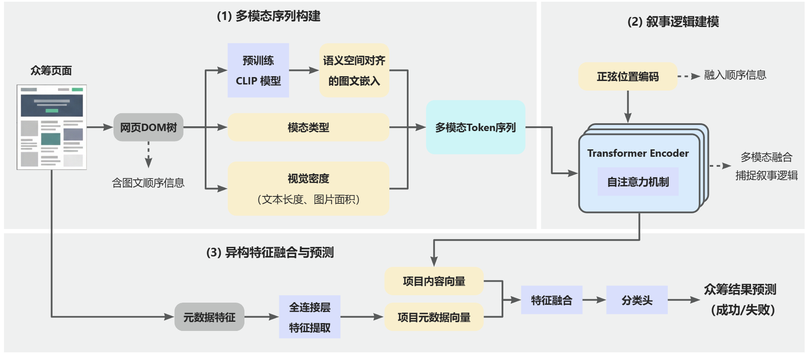

## 3.3 多模态数据表征与图文序列构建
为了模拟投资者在众筹页面上的“叙事传输”体验，模型需要将非结构化的网页内容转化为具备顺序特征和物理属性的结构化输入。本节详细说明如何将文本、图像及布局属性编码为统一的多模态序列。

### 3.3.1 多模态语义表征
本文的多模态输入由文本与图像的特征向量共同构成。为解决多模态融合中常见的语义空间不一致问题，消除建模时模态间的语义鸿沟，本研究通过统一嵌入后端、各模态差异化向量生成及离线固定表征等环节，构建了标准化的特征提取流程。 

实现多模态语义表征的核心在于引入预训练的 CLIP 模型作为图像与文本的向量化后端。通过在 4 亿规模的图像-文本对数据集上进行对比学习，CLIP 模型将视觉编码器和文本编码器映射至同一个对齐的特征空间中，使得生成的图文向量在语义维度上天然对齐，下游序列模型可以忽略底层模态差异，专注于捕捉跨模态叙事逻辑。在具体模型版本选择上，本研究采用 OpenAI 开源的 ViT-B/32 版本。其视觉编码器采用 Vision Transformer 架构，将输入图像划分为$ 32 \times 32 $像素的补丁（Patches）进行全局特征提取；文本编码器采用 Transformer 架构，利用自注意力机制对文本 Token 进行语义建模。向量化后图像向量与文本向量维度一致，均为 $ D_{\text{img}}=D_{\text{txt}}=512 $。

在向量生成机制的设计上，为了确保特征提取的质量，本文针对不同模态的特性设计了不同的向量化流程。对于项目封面图及正文图像，首先将其转换为 RGB 格式并进行标准化的尺寸缩放，随后提取 512 维的全局视觉特征向量，并对其进行$ L_2 $归一化处理，以消除非语义因素对特征分布的影响。对于文本，由于文本编码器存在 77 个 Token 的硬性长度限制，而众筹项目中有大量长文本内容，本研究设计了基于滑动窗口的表征机制。首先，将长文本按照最大窗口长度切分为多个重叠的内容片段，每次滑动的步长设定为 32 个 Token，确保片段间的上下文连续性；随后对同一文本块生成的多个片段特征向量执行均值池化，并对结果再次进行$ L_2 $归一化，从而获得能够覆盖整段文本信息的表征向量。

后续训练使用的所有图文向量均在训练前离线生成并保持固定，训练阶段不再微调模态编码器，仅加载对应向量参与建模。这一设定旨在排除嵌入模型底层编码能力的差异，使实验差异集中在模型结构而非模态编码器能力上，确保实验性能的提升完全源于模型对众筹内容呈现逻辑的捕捉能力，保证对比实验的公平性。

最后，本研究选取图文信息时遵循以下原则：对于每个项目，文本侧信息包含标题、简介以及正文内容块中的多段文本；图像侧信息包含封面图以及正文中的多张图片。

### 3.3.2 视觉密度特征提取
为了量化加工流畅性理论中的“视觉密度”特征，本文为序列中的每个位置定义了辅助信息向量：对每个位置 $ i\in\{1,\ldots,L\} $，定义类型标识 $ t_i\in\{0,1\} $（文本为 0，图片为 1）、标量属性 $ a_i\in\mathbb{R} $。每个内容块的标量属性 $ a $ 为其结构信息，用于提供与视觉密度相关的粗粒度物理线索。针对不同模态，标量属性的计算方式如下：

(1) 对于文本块，令 $ \ell $ 为文本长度， 通过对数变换平滑长尾分布：

$ a=\log(\max(1,\ell)); $

(2) 对于图片块，令 $ w,h $ 为图片的分辨率宽高，则其面积为 $ \text{area}=w\cdot h $，同理进行对数处理：

$ a=\log(\max(1,\text{area})). $

通过将语义向量与上述结构属性相融合，模型能够同时感知“叙事内容”与“呈现节奏”，从而更精准地预测投资者的决策反馈。

### 3.3.3 叙事序列构建
基于线性叙事理论，本文放弃了传统的晚期融合范式，转而将页面内容抽象为符合人类浏览顺序的统一序列。序列由固定前缀与正文内容块组成，前缀包含标题、简介与封面图；随后按页面呈现顺序，即 HTML DOM 树中真实的物理展示顺序拼接正文中的图文块。

为模拟用户在有限注意力下的前部窗口浏览行为，并平衡计算效率，本文设定块长度上限为 40（ 即 $ L_{\max}=40 $），并固定取页面前部窗口。前缀长度固定为 3，设正文长度为 $ L_{\text{body}} $，则截断前序列长度为 $ 3+L_{\text{body}} $，统一后的序列实际长度为：

$ L=\min(3+L_{\text{body}},L_{\max}) $

## 3.4 统一序列预测模型设计
本研究构建了一个基于统一序列建模范式的多模态深度学习模型 MSTC。模型的核心思想是将项目内容表示为统一的图文 Token 序列，通过 Transformer 显式建模 Token 间的叙事交互，并融合元数据进行预测。

### 3.4.1 Token 编码器
为了将异构的语义向量、类型信息与物理属性整合为统一的隐藏层表示，本研究在模型的 Token 编码器模块构建了一套层次化的特征融合流程。 

模态投影作为流程的起点，旨在消除不同原始模态间的量纲差异。设第 $ i $ 个位置的图像与文本嵌入向量分别为 $ e_i^{\text{img}}\in\mathbb{R}^{512} $ 与 $ e_i^{\text{txt}}\in\mathbb{R}^{512} $。模型首先对两种模态分别做线性投影并经 ReLU 激活：

$ u_i^{\text{img}}=\text{ReLU}(W_{\text{img}}e_i^{\text{img}}+b_{\text{img}}),\quad
u_i^{\text{txt}}=\text{ReLU}(W_{\text{txt}}e_i^{\text{txt}}+b_{\text{txt}}), $

其中权重矩阵 $ W_{\text{img}},W_{\text{txt}}\in\mathbb{R}^{256\times 512} $。 

在获得投影向量后，模型依据输入序列中的类型标识动态选择有效的模态投影，确保对应位置仅保留所属模态的特征表达：

$ u_i=\mathbb{I}[t_i=1]\cdot u_i^{\text{img}}+\mathbb{I}[t_i=0]\cdot u_i^{\text{txt}}. $

模型通过类型与属性注入进一步丰富 Token 的上下文含义。为了显式区分图像块与文本块，本研究引入了可学习的类型嵌入表 $ E_{\text{type}}\in\mathbb{R}^{2\times 256} $，显式编码该位置的类型，通过查表操作获取类型编码：

$ v_i=E_{\text{type}}(t_i). $

属性标量通过线性层投影到隐藏空间，转化为能够与语义特征对齐的维度： 

$ w_i=W_{\text{attr}}a_i+b_{\text{attr}},\quad W_{\text{attr}}\in\mathbb{R}^{256\times 1}. $

整个编码过程汇聚于特征融合层，最终 Token 表示定义为三者相加后的正则化输出： 

$ x_i=\text{Dropout}\big(\text{LayerNorm}(u_i+v_i+w_i)\big), $

其中 Token 级 Dropout 取 0.33。

综上所述，图文序列通过 Token 编码器后得到序列张量 $ X\in\mathbb{R}^{B\times L_{\max}\times 256} $，为后续建模奠定了数据基础。

### 3.4.2 正弦位置编码
在图文 Token 序列进入 Transformer 序列编码器前，必须赋予模型感知呈现顺序的能力，以模拟投资者沿纵向页面浏览时的线性感知过程。为显式刻画图文块的先后排列关系，本研究在序列中注入固定的正弦位置编码（Position Encoding）。对位置 $ p\in\{0,\ldots,L_{\max}-1\} $ 与维度索引 $ k $，编码定义如下：

$ \text{PE}(p,2k)=\sin\left(\frac{p}{10000^{2k/d}}\right),\quad
\text{PE}(p,2k+1)=\cos\left(\frac{p}{10000^{2k/d}}\right), $

在有效位置上进行元素级相加，得到增强顺序感知的输入向量：

$ x'_i=x_i+m_i\cdot \text{PE}(p=i-1). $

该设计确保了模型对图文顺序的识别能力：若不加位置编码，则 Transformer 架构退化为对无序 Token 集合的处理；而加入位置编码后，模型具备表达相对位置与顺序模式的能力，从而可用于检验顺序信息的边际贡献。

### 3.4.3 Transformer 序列编码器
位置编码后的图文 Token 序列进入 Transformer 编码器。该模块通过多头自注意力机制模拟读者在阅读过程中不断回溯上下文、印证图文逻辑的认知行为。

编码器由两层编码层堆叠构成，每层隐藏维度位 $ d=256 $，多头数 $ H=4 $（每头维度 $ d_k=64 $），前馈网络中间维度 $ d_{\text{ff}}=512 $，Dropout 率为 0.1，采用 pre-LN 结构以提升训练稳定性。

设第 $ \ell $ 层输入为 $ Z^{(\ell-1)}\in\mathbb{R}^{B\times L_{\max}\times 256} $， 则单层编码过程定义为：

$ \tilde{Z}^{(\ell)}=Z^{(\ell-1)}+\text{MHA}(\text{LN}(Z^{(\ell-1)})), $

$ Z^{(\ell)}=\tilde{Z}^{(\ell)}+\text{FFN}(\text{LN}(\tilde{Z}^{(\ell)})), $

其中多头注意力的核心计算如下：

$ \text{MHA}(x)=\text{Concat}(\text{head}_1,\ldots,\text{head}_H)W^O,\quad
 $

$ \text{head}_h=\text{softmax}\left(\frac{Q_hK_h^\top}{\sqrt{d_k}}\right)V_h, $

前馈网络定义为：

$ \text{FFN}(x) = W_2\text{ReLU}(W_1x + b_1) + b_2 $

经过两层编码，模型输出蕴含了深度跨模态交互信息的序列表示 $ Z\in\mathbb{R}^{B\times L_{\max}\times 256} $。

### 3.4.4 融合分类
通过 Transformer 编码器捕获 Token 间的叙事交互后，模型需要将局部的、动态的序列信息聚合为全局的项目表征，并结合结构化元数据给出最终的预测结果。 

为了从图文交替的叙事流中提取出反映项目整体质量的特征向量，本文对 Transformer 输出的序列表示进行屏蔽均值池化（Masked Mean Pooling），得到项目级内容表示$ h\in\mathbb{R}^{256} $：

$ h=\frac{\sum_{i=1}^{L_{\max}} m_i z_i}{\sum_{i=1}^{L_{\max}} m_i}, $

其中 $ z_i $ 表示 $ Z $ 在位置 $ i $ 的向量。该设计模拟了投资者在阅读完整个页面后形成的综合印象。

除了页面内容呈现的叙事价值外，项目的先天背景（如目标金额、持续时间）也是影响决策的关键因素。本研究将 155 维的结构化元数据特征$ x_{\text{meta}}\in\mathbb{R}^{155} $， 输入一层多层感知机（MLP）进行非线性映射，得到元数据表示：

$ h_{\text{meta}}=\text{Dropout}\big(\text{ReLU}(W_{\text{meta}}x_{\text{meta}}+b_{\text{meta}})\big), $

其中隐藏层维度为 128，Dropout 为 0.2，故 $ h_{\text{meta}}\in\mathbb{R}^{128} $。

将代表图文序列整体叙事的向量与代表项目属性的元数据向量进行拼接，形成最终的融合表征向量：

$ f=[h;h_{\text{meta}}]\in\mathbb{R}^{384}. $

分类头负责将融合后的多维特征映射为预测空间。为了提升训练稳定性并防止过拟合，本文采用了两层全连接结构并引入层归一化（LayerNorm）： 

$ \tilde{f}=\text{LN}(f),\quad
g=\text{Dropout}\big(\text{ReLU}(W_f\tilde{f}+b_f)\big),\quad
z=w^\top g+b, $

其中 $ W_f $ 将输入映射到 512 维隐藏层， Dropout 率为 0.5，最终输出标量 Logit$ z $, 代表该众筹项目成功预测的原始得分。

### 3.4.5 模型总体结构
本节构建了一个整合多模态内容序列与项目元数据的众筹成功预测模型 MSTC，它通过两条并行的特征提取路径实现了对众筹项目的深度表征。模型的完整逻辑架构及内部参数如图 3-2 所示。 

**图 3-2 MSTC 模型结构参数图 **

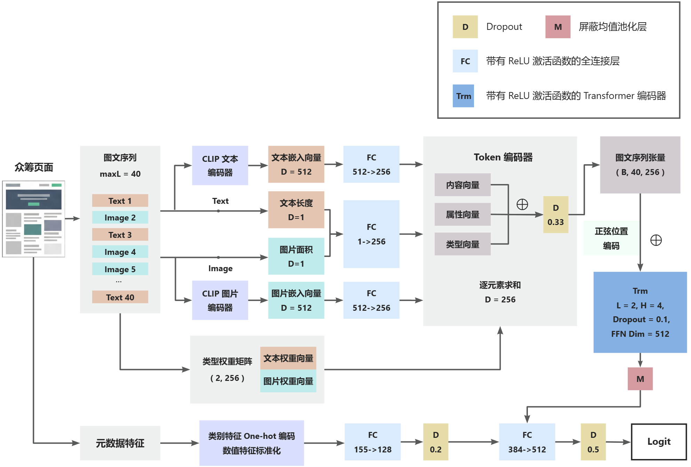

## 3.5. 训练目标与优化策略
### 3.5.1 概率输出与损失函数
本研究将众筹成功性预测建模为二分类任务。模型末层输出原始分数 Logit$ z $并通过 Sigmoid 函数映射为预测概率$ \hat{p}=\sigma(z) $。采用二分类交叉熵作为目标损失函数，以衡量预测分布与真实分布之间的差异：

$ \mathcal{L}=-\frac{1}{N}\sum_{i=1}^{N}\left(\tilde{y}_i\log \hat{p}_i+(1-\tilde{y}_i)\log(1-\hat{p}_i)\right), $

其中 $ \tilde{y} $ 是经过标签平滑（Label Smoothing）处理后的软标签。传统的硬标签（0或1）容易导致模型在训练时过于自信，进而引发过拟合，降低验证集和测试集上的预测准确度。为缓解过拟合并提升模型表现，本文采用平滑系数 $ \epsilon=0.05 $，对原始标签 $ y\in\{0,1\} $进行如下变换：

$ \tilde{y}=(1-\epsilon)y+\frac{\epsilon}{2}. $

通过该处理后，正类标签从 1 变为 0.975，负类标签从 0 变为 0.025，强制模型学习更具有泛化性的特征。该处理在所有对照实验中保持一致。

### 3.5.2 训练配置与稳定性策略
本文采用了一系列策略以确保模型训练的收敛速度与推理阶段的稳定性：

(1) 优化器选择：使用 AdamW 优化器作为模型训练的优化方案。在标准的 Adam 优化器中，$ L_2 $正则化项通常被直接合并至损失函数，正则与梯度更新耦合在一起。这种耦合会导致正则化项的实际强度随梯度变化产生波动，从而使正则化项失去预期的约束作用。 

针对这一局限性，AdamW 算法显式地将权重衰减与梯度更新解耦，使其能够以恒定的速率作用于参数更新，能够更有效地防止模型参数过大，提升正则化效果。AdamW 的核心更新流程遵循以下公式：

$ \begin{aligned}
g_t &= \nabla_{\theta} L_t(\theta_{t-1}) ,
\\
m_t &= \beta_1 m_{t-1} + (1 - \beta_1) g_t, \\
v_t &= \beta_2 v_{t-1} + (1 - \beta_2) g_t^2, \\
\theta_t &= \theta_{t-1} - \eta_t \left( \frac{\hat{m}_t}{\sqrt{\hat{v}_t} + \epsilon} + \lambda \theta_{t-1} \right).
\end{aligned} $

上式中，$ \eta_t $代表学习率，$ \lambda $代表预设的权重衰减系数。

在这一更新逻辑下，权重衰减项 $ \lambda \theta_{t-1} $ 直接作用于参数更新步骤，而不参与动量与二阶矩的自适应缩放计算。这种独立的权重衰减机制确保了无论梯度如何演变，模型始终能受到恒定的参数约束，从而能够更有效地抑制模型过拟合。 

(2) 学习率调度策略：为平衡训练初期的稳定性和后期的收敛精度，学习率调度采用线性预热（Warmup）配合余弦退火（Cosine Annealing）策略。设总训练步数为 $ T $，本文将线性预热阶段比例设置为 0.1（即 Warmup 步数 $ T_w=0.1T $）。学习率随步数的变化定义如下：

$ \eta(t)=
\begin{cases}
\eta_0\cdot \frac{t}{T_w}, & 0\le t<T_w,\\
\eta_{\min}+(\eta_0-\eta_{\min})\cdot \frac{1+\cos\left(\pi\frac{t-T_w}{T-T_w}\right)}{2}, & T_w\le t\le T.
\end{cases} $

在预热期，学习率线性增加以避免梯度爆炸；在退火期，学习率按余弦曲线缓慢下降，有助于模型在损失函数表面的局部极小值附近进行精细搜索。

(3) 全局梯度裁剪：在训练过程中，由于长序列数据高度复杂的特征交互，梯度在反向传播时可能出现数值过大的现象，即所谓的“梯度爆炸”。为解决这一问题，本文使用了全局梯度裁剪技术，通过设定最大范数阈值$ L=1.0 $，对模型所有参数的梯度进行整体缩放。核心公式如下： 

$ \hat{g} = g \cdot \min \left( 1, \frac{L}{\|g\|_2} \right) $

其中，$ g $代表模型全体参数的梯度向量，$ \|g\|_2 $为该向量的 $ L_2 $ 范数。

该策略能有效限制单次参数更新的跨度，保障训练过程的平滑性。 

(4) 指数滑动平均（Exponential Moving Average, EMA）： 在模型推理阶段，本文使用 EMA 参数而非即时参数，该技术旨在使用参数的滑动平均值而非单次迭代值进行推理，更新过程遵循以下公式：

$ \theta_{EMA}^{(t)} = \beta \cdot \theta_{EMA}^{(t-1)} + (1 - \beta) \cdot \theta_t $

其中，$ \theta_t $为当前迭代步的模型参数，$ \beta $为衰减系数（本文设定为 0.999）。

由于深度学习的训练曲线往往存在随机噪声和局部震荡，模型在最后一个步长处的权重未必处于最优状态。EMA 通过对历史权重进行加权平均，能够过滤掉训练过程中的随机扰动，捕捉到更具代表性的全局特征。这种策略使得模型真实应用场景中表现得更加稳健，能够降低评价指标的波动性，提升模型在众筹成功预测任务中的评估效果。 

### 3.5.3 模型选择与阈值确定
在模型性能评估和最优检查点 （Checkpoint）的选择上，本文区分了“阈值无关指标”与“阈值相关指标”，采取分阶段的评价策略。

在训练与验证阶段，本研究首先关注模型的原始输出概率质量，只计算阈值无关指标，即验证集 AUC（ROC 曲线下面积）和验证集对数损失（BCE Loss）。这两个指标反映了模型对样本分类排序的整体能力：AUC 衡量了模型对样本的排序能力（即正样本概率高于负样本的概率），而 BCE 反映了预测概率与真实分布的逼近程度。 这两个指标均与具体分类阈值的选取无关，能够客观评价模型特征提取的稳健性。因此，本文的最优检查点按验证集 AUC 最大化的标准来选择。 

在评估阶段，本研究采用动态阈值搜索方案。由于众筹成功预测最终需给出具体的“成功/失败”判定，模型输出的连续概率$ \hat p $必须通过阈值$ \tau $转换为二元类别。预测规则定义为如下指示函数：

$ \hat{y}(\tau)=\mathbb{I}[\hat{p}\ge \tau]. $

基于预测结果，我们可以计算阈值相关指标，即精确率（Precision）、召回率（Recall）以及权衡两者的 F1 分数：

$ \text{P}(\tau)=\frac{TP(\tau)}{TP(\tau)+FP(\tau)},\quad
\text{R}(\tau)=\frac{TP(\tau)}{TP(\tau)+FN(\tau)}, $

$ \text{F1}(\tau)=\frac{2\text{P}(\tau)\text{R}(\tau)}{\text{P}(\tau)+\text{R}(\tau)}. $

为了在测试集上获得最优的分类效果，平衡精确率与召回率，本文不直接采用默认的 0.5 作为分类阈值，而是在验证集上进行阈值动态搜索。具体而言，模型在验证集概率上搜索最优阈值 $ \tau ^* $，以最大化验证集 F1 分数：

$ \tau^*=\arg\max_{\tau\in\mathcal{T}}\text{F1}(\tau), $

其中 $ \mathcal{T} $ 为验证集预测概率的候选阈值集合；若出现多个 $ \tau $ 达到相同的最大 F1 分数，则选择较小的阈值。该阈值一旦确定，即固定用于后续测试集所有评价指标的计算，确保测试集的评估指标（如测试集 F1 分数、精确率、召回率）是在验证集的最优分类标准下计算得出的。 

## 3.6 本章小结
本章详细阐述了基于统一序列建模范式的多模态深度学习模型 MSTC 的建模方案。建模核心逻辑在于将心理学中的叙事传输理论与计算机技术相结合，构建一个能够感知众筹界面内容呈现结构的深度学习模型。

主要内容总结如下：

(1) 理论驱动的建模策略：模型突破了传统多模态预测仅关注内容语义的局限，显式地对图文顺序与视觉密度进行了建模。利用正弦位置编码为模型赋予位置感知能力，通过提取图文块的物理属性量化页面的视觉密度节奏。

(2) 图文序列数据处理：针对众筹页面非结构化的特点，本文设计了一套数据整合流程。按照网页 DOM 树的真实物理顺序，将标题、封面、正文图文块拼接为长度固定的多模态 Token 序列，并使用预训练的 CLIP 模型作为统一后端，消除图像与文本间的语义鸿沟。

(3) 模型架构设计：本文构建的深度学习模型由 Token 编码器、Transformer 序列编码器和融合预测层三部分组成。Token 编码器融合 CLIP 提取的语义向量、模态类型及物理属性；Transformer 序列编码器利用多头自注意力机制捕捉跨模态交互特征；融合预测层聚合序列信息，并与项目元数据特征融合，最终输出预测概率。

(4) 训练优化策略：本文通过一系列优化策略确保模型在复杂多模态数据下的泛化能力与稳定性，包括多数类下采样、Label Smoothing、AdamW优化器、学习率调度策略、全局梯度裁剪、 指数滑动平均（EMA）技术、动态阈值搜索等。

本章构建的模型将用于后续实验验证，通过对比实验和消融实验检验模型效果。

# 第 4 章 实验过程及结果分析
本章旨在验证本文提出的图文统一序列建模范式在众筹成功性预测任务中的有效性，在统一的输入契约与训练评估口径下汇报实验结果，所有模型在数据表示与训练流程上保持一致。

实验分为两部分：首先，通过与主流建模范式的对比，验证本文模型的整体优势。其次，通过顺序维度的消融实验，探究呈现结构与叙事逻辑的判别效力；通过属性维度的消融实验，量化图文物理属性（如文本长度、图片尺寸）所表征的视觉密度对预测性能的影响。 

## 4.1 数据采集与预处理
### 4.1.1 数据来源
本文研究数据来源于全球领先的奖励式众筹平台 Kickstarter。Kickstarter作为全球最大的奖励型众筹平台，其数据被广泛应用于众筹预测研究，该平台具有以下特点：

+ 规模大：拥有海量的历史项目数据，支持大规模模型训练。
+ 模态丰富：包含项目描述、图片、视频、更新、评论等多种信息。
+ 标注清晰：项目状态明确，便于监督学习。
+ 时间跨度长：可研究长期趋势变化。

因此，本研究基于 Web Robots 平台提供的 Kickstarter 公开数据集进行元数据解析，提取项目 URL、众筹状态、目标金额等核心字段。依据各项目 URL，研究构建了基于 DrissionPage 的自动化爬虫管线。该系统通过模拟真实浏览器环境访问项目主页，利用 BeautifulSoup 对抓取的页面源代码进行解析，通过解析 HTML DOM 结构定位项目背景描述区域，按照 HTML 元素的物理排列顺序，依次提取文本块与图像 URL，形成反映界面呈现逻辑的原始多模态序列。在资源下载阶段，本文利用图像处理库 Pillow 对图片格式校验与尺寸测量，并将图文顺序、图片大小和文本长度一并存入结构化的 JSON 档案中，用于后续图文序列构建。 

### 4.1.2 样本清洗
本文以项目为样本单位，按以下原则进行项目筛选与清洗：

+ 只保留状态为 successful 和 failed 的项目，移除 canceled / live / suspended 等进行中或异常状态的记录。
+ 剔除正文为空、封面图片缺失或无法解析的无效样本。
+ 剔除持续时间过短的项目（小于5天）。
+ 剔除出现次数过低的类别（国家、币种出现次数小于100，类别出现次数小于50），减少长尾类别带来的极端稀疏特征。

最终构建的可训练数据集包含 31586 个项目，样本时间范围覆盖 2023-01-01 至 2025-12-11。 本文通过对多数类样本进行随机下采样，实现了正负样本的严格均衡，成功样本与失败样本各 15793 个。标签由项目状态映射得到，successful 记为 1，failed 记为 0。

### 4.1.3 元数据特征提取
在内容嵌入之外，本文还引入了结构化元数据以增强模型表征能力。元数据包含三类离散特征与两类数值特征。

离散特征为项目类别、国家与币种，均采用 One-hot 编码。

数值特征为：

(1) 项目持续时间：持续时间以天为单位定义为：

$ \text{duration\_days}=\frac{\text{deadline}-\text{launched\_at}}{86400} $

(2) 项目目标金额：以美元为基准并做对数变换以平滑数据分布：

$ \text{log\_usd\_goal}=\log(1+\text{usd\_goal}) $

以上数值特征采用训练集统计量做标准化。

最终元数据特征维度为 155 维，包括项目类别 117 维，国家 22 维，币种 14 维，数值特征 2 维。这些特征通过独立分支编码后，在分类头处与序列特征进行融合预测。

**表 4-1 元数据特征**

| **特征类别** | **特征名称** | **处理方式** | **维度** |
| --- | --- | --- | --- |
| **离散特征** | 项目类别 category | One-hot 编码  | 117 维  |
| | 国家 country | One-hot 编码  | 22 维  |
| | 币种 currency | One-hot 编码  | 14 维  |
| **数值特征** | 项目持续时间 duration_days | 以天为单位，并进行标准化处理  | 1 维  |
| | 项目目标金额 log_usd_goal | 以美元为基准进行对数变换，并进行标准化处理  | 1 维  |
| **总计** | -- | -- | **155 维** |

## 4.2 实验设置与评价口径
### 4.2.1 实验设置
(1) 数据划分策略

为确保实验对比的公平性、稳定性和结果的可复现性，本研究采用多轮随机实验取平均值的评估方案。所有模型均在五个不同的随机数种子下进行独立训练与测试，最终汇报五次实验结果的算术平均值。通过在每一轮实验中严格对齐种子，各模型使用的训练集、验证集、测试集划分完全一致（划分比例为 6:2:2），从而排除了数据采样差异对性能评估的干扰。

(2) 训练配置

本研究在统一的计算环境下配置了各模型的训练参数，以排除工程实现差异对模型性能的影响。

实验环境如表 4-2 所示：

**表 4-2 实验环境**

| 环境类别 | 参数项 | 环境说明 |
| :---: | :---: | :---: |
| 操作系统 | OS | Ubuntu 24.04.1 LTS |
| 硬件环境 | CPU | Intel(R) Xeon(R) Silver 4116 CPU @ 2.10GHz |
| | GPU | NVIDIA GeForce RTX 3090 (24GB VRAM) |
| | 内存 | 256 GB |
| 软件环境 | Python版本 | 3.11.14 |
| | 深度学习框架 |  PyTorch 2.9.1 (CUDA 12.8)  |
| | 核心依赖库 |  Transformers, DrissionPage, BeautifulSoup4, Pillow等  |

具体的超参数设定如下：

+ 优化算法与学习率：初始学习率 $ \eta_0 $ 设定为 $ 5\times10^{-4} $，并采用余弦退火策略逐步衰减至最小学习率 $ \eta_{min}=10^{-5} $。
+ 正则化与批处理：为防止模型过拟合，权重衰减（Weight Decay）系数设定为 $ 4\times 10^{-4} $；批处理大小（Batch Size）统一设定为 256。
+ 迭代轮数：最大训练轮数设定为 80 Epochs，以确保模型充分收敛。

(3) 多模态输入约定

为了公平地评估不同建模范式对众筹项目内容的表征能力，所有模型均共享相同的内容输入窗口：

+ 图文表征：图像与文本均使用预训练的 CLIP 模型离线提取 512 维嵌入向量，并统一投影映射至 256 维。
+ 样本构成：每个项目由标题、简介、封面图与正文内容块共同表示，其中正文部分按照 HTML DOM 树中真实的物理展示顺序进行图文交替排列。
+ 截断策略：为模拟用户关注页面前部信息的浏览行为、控制计算量并保证对照公平，内容块长度上限固定为 40，并统一取页面前部窗口。

### 4.2.2 评价口径
为全面客观地评估各模型在众筹成功性预测任务中的表现，本研究采用了二分类任务中通用的评价指标。这些评价指标的计算基于二分类任务的混淆矩阵，混淆矩阵通过对比模型预测结果与真实标签，将样本划分为以下四个基础维度：

(1) 真正例（True Positive, TP）：模型正确预测为“成功”的成功项目数量。

(2) 假正例（False Positive, FP）：模型错误预测为“成功”的失败项目数量（即假阳性）。

(3) 真负例（True Negative, TN）：模型正确预测为“失败”的失败项目数量。

(4) 假负例（False Negative, FN）：模型错误预测为“失败”的成功项目数量（即假阴性）。

对于给定的分类阈值 $ \tau $，模型根据如下指示函数来预测项目是否成功：

$ \hat{y}(\tau)=\mathbb{I}[\hat{p}\ge\tau]. $

其中，$ \hat{p} $为模型输出的预测概率。当概率大于或等于阈值$ \tau $时，判定项目为成功，否则判定为失败。

基于上述混淆矩阵计数，本文定义的评价指标及其计算公式如下：

(1) 准确率（Accuracy, Acc）：代表模型预测正确的样本（包括成功和失败）占总样本的比例，反映了模型的整体判别能力。其公式为：

$ \mathrm{Acc}(\tau)=\frac{TP(\tau)+TN(\tau)}{TP(\tau)+FP(\tau)+FN(\tau)+TN(\tau)} $

(2) 精确率（Precision, P）：又称查准率，代表在模型预测为“成功”的所有样本中，真正成功的项目所占的比例。其公式为：

$ \mathrm{P}(\tau)=\frac{TP(\tau)}{TP(\tau)+FP(\tau)} $

(3) 召回率（Recall, R）：又称查全率，代表在所有真实的成功项目中，被模型正确预测出来的比例。其公式为：

$ 
\mathrm{R}(\tau)=\frac{TP(\tau)}{TP(\tau)+FN(\tau)} $

(4) F1 分数（F1-score）：由于精确率与召回率存在权衡冲突，F1 分数作为两者的调和平均数，能够综合评价模型在查准和查全两方面的平衡表现。其公式为：

$ \mathrm{F1}(\tau)=\frac{2\mathrm{P}(\tau)\mathrm{R}(\tau)}{\mathrm{P}(\tau)+\mathrm{R}(\tau)}=\frac{2TP(\tau)}{2TP(\tau)+FP(\tau)+FN(\tau)} $

除了上述与阈值相关的指标外，本研究还引入了阈值无关指标 AUC（Area Under Curve）。AUC 的物理意义可以解释为：随机抽取一个正样本和负样本，正样本得分大于负样本得分的概率。其公式为：

$ \mathrm{AUC}=\Pr(\hat{p}^+>\hat{p}^-)+\frac{1}{2}\Pr(\hat{p}^+=\hat{p}^-). $

在实验的模型选择与评估阶段，本研究采取分步策略：首先，以验证集的 AUC 最大化为标准，选择模型训练过程中的最优轮次，以保证模型具有最强的排序能力。在最佳轮次确定后，本文不直接采用 0.5 作为判断项目是否成功的阈值，而是在验证集概率分布上进行动态搜索，找到使验证集 F1 分数最大化的最优阈值$ \tau^* $。最后，用 $ \tau^* $ 计算测试集上的准确率、精确率、召回率与 F1 分数，作为最终汇报的模型性能指标。

## 4.3 对比实验
### 4.3.1 基线模型介绍
为了全面评估本文提出的 MSTC（Multimodal Sequential Transformer for Crowdfunding）模型的有效性，本节挑选了三种代表性的建模范式，覆盖了简单全局统计、局部特征提取和晚期融合序列建模三种类型，作为基线模型（Baseline）与本文模型进行对比。

(1) 无序集合范式（Mean-Pool）：该模型假设页面信息为离散模块的无序堆砌，完全忽略了模块间的空间与逻辑关联。

其结构层级如下：

+ 输入层：接收预训练模型提取的图像特征 $ v \in \mathbb{R}^{N \times d_v} $ 与文本特征 $ t \in \mathbb{R}^{N \times d_t} $
+ 特征对齐层：通过线性变换将不同维度的模态特征映射至统一的隐空间。
+ 池化层：对输入序列中的 Token 进行逐元素求和并取均值，从而压缩得到全局静态表示。
+ 预测层：全局向量送入多层感知机（MLP）进行二分类预测。

该基线不包含 Token 间的注意力交互，反映了仅依赖图文内容而无结构信息的性能下限。

(2) 卷积融合范式（MDL）：该模型复现了先前论文中基于 CNN 的多分支融合模型，代表了具有优秀局部特征提取能力的建模范式。

MDL 模型的结构特点是：

+ 图像与文本分支：采用并行的一维卷积编码器（1D-CNN）。通过设置不同尺寸的卷积核对输入序列进行滑动窗口扫描，以捕获多模态数据内部的局部模式，随后衔接最大池化层（Max-pooling）提取最显著特征。
+ 元数据分支：对于众筹项目相关的数值型与类别型元数据，通过全连接层将高维稀疏特征映射到低维连续向量空间。
+ 融合层：采取晚期融合策略，将图像、文本和元数据三个独立分支产生的特征向量进行水平拼接。
+ 预测层：融合后的全局向量送入多层感知机（MLP）进行二分类预测。

与本文不同，MDL 不以 Transformer 显式建模序列，其表现将更多反映卷积结构对局部模式的表征能力。

(3) 晚期融合范式（Late-MSTC）：该模型是本文 MSTC 模型的晚期融合变体，旨在通过剥离跨模态交互机制，验证 Token 级图文对齐的必要性。

其与 MSTC 的主要区别在于： 

+ 双塔序列架构：不同于 MSTC 构造的统一图文 Token 序列，Late-MSTC 采用并行的双塔结构分别处理图像序列与文本序列。虽然两分支仍沿用模态投影、属性注入与正弦位置编码，但在进入 Transformer 前并未合并。 
+ 模态内自注意力交互：Transformer 编码器仅在各模态内部独立执行自注意力计算。这意味着图像 Token 仅能感知视觉叙事顺序，文本 Token 仅能感知语义上下文，模态间在特征提取阶段完全解耦。 
+ 向量级晚期融合：模型分别对图像与文本序列执行屏蔽均值池化（Masked Mean Pooling），提取各自的全局表示。随后，模型将两个模态的特征向量与元数据向量进行拼接，并在最终的分类头处实现高层语义聚合。 

为严格控制实验变量并确保对比的公正性，Late-MSTC 采用参数共享的双塔 Transformer 架构，图像与文本分支共用同一套编码器权重，使得模型在总参数量与计算容量上与本文 MSTC 模型保持严格一致。在该设计下，两者的核心差异仅在于是否允许模态间进行 Token 级的交互映射，而其余超参数设定（如层数、隐层维度及注意力头数等）完全相同。此举旨在排除模型容量差异带来的性能干扰，从而验证细粒度跨模态交互在众筹成功性预测中的必要性。 

### 4.3.2 实验结果与分析
表 4-3 与图 4-1 共同展示了各模型在测试集上的综合表现，汇报数据取五次实验结果的算术平均值。 

**表 4-3 对比实验：五次实验平均性能对比**

| 模型名称 | Accuracy | Precision | Recall | F1-score | AUC |
| --- | --- | --- | --- | --- | --- |
| Mean-Pool | 0.8205 | 0.7897 | 0.8734 | 0.8293 | 0.9086 |
| MDL | 0.8243 | 0.7891 | **0.8843** | 0.8339 | 0.9101 |
| Late-MSTC | 0.8285 | 0.7957 | 0.8830 | 0.8370 | 0.9164 |
| MSTC | **0.8331** | **0.8066** | 0.8766 | **0.8398** | **0.9198** |

**图 4-1 对比实验：五次实验平均性能对比**

<!-- 这是一张图片，ocr 内容为： -->
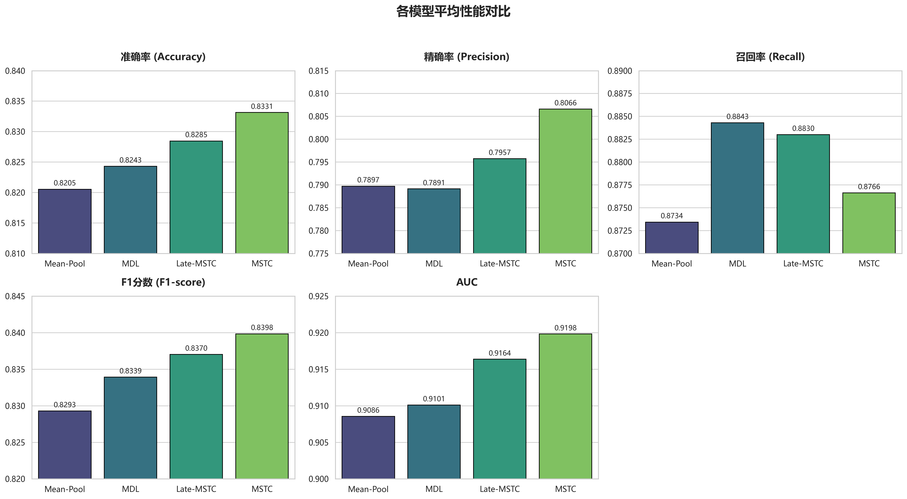

实验结果显示，本文提出的 MSTC 模型在 Accuracy、F1-score 和 AUC 等核心评价维度上均显著优于其他基准模型。值得注意的是，MSTC 模型并没有取得最高的 Recall，然而在所有模型中，MSTC 模型的 Precision 和 Recall 最为平衡且 F1-score 最高，这表明其他模型倾向于过度预测项目成功来换取更高的召回率。对于众筹平台而言，这样的模型会产生大量的假阳性（将失败项目误判为成功），不稳定的决策会增加平台的运营风险。

为排除数据随机划分对实验结论的干扰，本文进行了五次独立重复实验，通过变换数据集随机种子（42-46）来观察模型性能波动情况。 

**图 4-2 对比实验：不同随机种子下的准确率对比**

<!-- 这是一张图片，ocr 内容为： -->
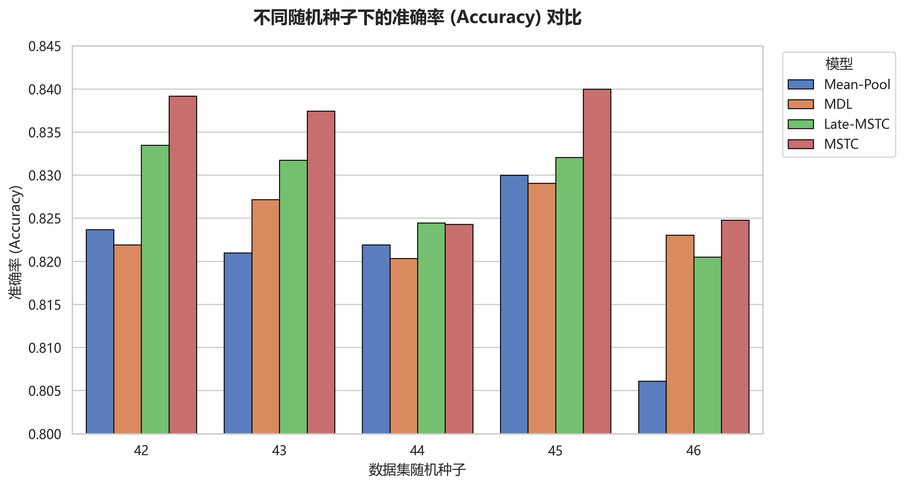

**图 4-3 对比实验：不同随机种子下的 AUC 对比**

<!-- 这是一张图片，ocr 内容为： -->
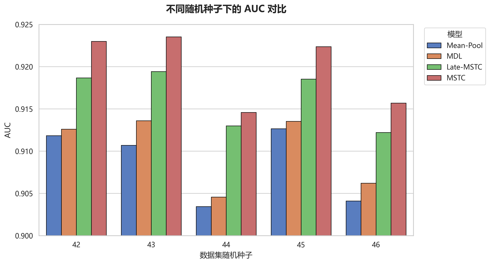

**图 4-4 对比实验：不同随机种子下的 F1-score 对比**

<!-- 这是一张图片，ocr 内容为： -->
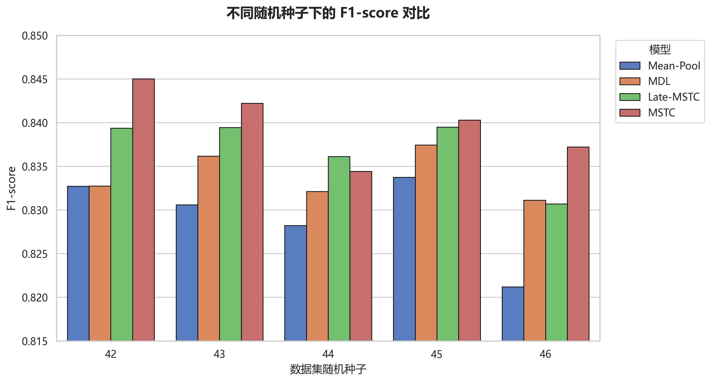

如图 4-2、4-3、4-4 所示，MSTC 模型在不同的随机种子设定下表现出了高度的一致性。在 Accuracy、AUC 与 F1-score 的对比中，MSTC 模型在绝大多数实验轮次中均稳居首位。这种稳定的实验表现证明，MSTC 模型能够捕捉到众筹数据中影响筹款结果的本质特征，而非仅仅拟合了特定数据子集的随机噪声。这种稳健性对于模型在实际生产环境中的复现与部署至关重要。

上述实验结果进一步证明了 MSTC 模型的两大优势：

首先，相比于 Late-MSTC 模型将模态割裂建模、末端拼接的做法，MSTC 实现了跨模态 Token 级的统一注意力交互。这意味着模型可以在更早的阶段学习到图像与文本之间的对齐关系，避免了晚期融合中由于信息压缩导致的语义损失。

其次，同为晚期融合模型，Late-MSTC 模型在绝大多数指标上均优于 MDL。这意味着 MSTC 系列模型通过引入位置编码与序列建模，捕捉到了众筹页面内图文顺序中蕴含的叙事逻辑关系，从而可以实现显著的性能提升。而 MDL 仅通过卷积提取局部模式，忽略了宏观的叙事逻辑，效果劣于 MSTC 模型甚至是 Late-MSTC 模型。这证明顺序建模是提升众筹预测精度的关键因素。

## 4.4 消融实验
### 4.4.1 叙事逻辑价值
为了深入探究图文排列顺序所表征的叙事逻辑对众筹成功预测的贡献，本节通过构建三种反事实场景进行消融实验，验证图文排列顺序的价值：

 (1) 全局注意力池化（Attn-Pool）：该变体模型在无序集合的基础上引入全局注意力机制，为不同内容块分配静态权重，旨在验证页面的判别力是否仅仅源于某些特定内容块（如某张精美图片）的加权贡献，而与展示顺序无关。

(2) 移除位置感知（NoPos-MSTC）：该变体模型完全剥离了 MSTC 中的位置编码，NoPos-MSTC 依靠 Transformer 架构能够捕捉 Token 间的复杂非线性交互（如局部图文节奏），但由于缺乏位置编码，无法感知全局叙事顺序。设计该对照的目的是区分模型容量提升与顺序信息引入的差异化贡献。

(3) 叙事崩塌假设（Shuffled-MSTC）：该变体保持与 MSTC 完全一致的网络架构与参数规模，但对每个样本的内容块序列进行随机置乱，并对置乱后的序列重新赋予位置编码，从而破坏位置与真实顺序的一致性。通过人工置乱原本有序的页面，构建“内容相同但逻辑破碎”的反事实场景，验证真实呈现顺序的边际价值。

表 4-4 归纳了各基线模型的结构差异：

**表 4-4 顺序消融实验：基线模型结构差异**

| 模型名称 | 序列编码器 | 位置编码 | 顺序是否保留 | 池化方式 |
| --- | --- | --- | --- | --- |
| Attn-Pool | 无 | 无 | 保留 | 单 query 注意力池化 |
| NoPos-MSTC | Transformer Encoder | 无 | 保留 | masked mean |
| Shuffled-MSTC | Transformer Encoder | 正弦位置编码 | 置乱 | masked mean |
| MSTC | Transformer Encoder | 正弦位置编码 | 保留 | masked mean |

表 4-5 与图 4-5 共同报告了各场景下的实验结果，同样取五次实验结果的算数平均值：

**表 4-5 顺序消融实验：五次实验平均性能对比**

| 模型名称 | Accuracy | Precision | Recall | F1-score | AUC |
| --- | --- | --- | --- | --- | --- |
| Attn-Pool | 0.8165 | 0.7754 | **0.8900** | 0.8287 | 0.9088 |
| NoPos-MSTC | 0.8269 | 0.7986 | 0.8748 | 0.8345 | 0.9131 |
| Shuffled-MSTC | 0.8324 | 0.8059 | 0.8751 | 0.8390 | 0.9183 |
| MSTC | **0.8331** | **0.8066** | 0.8766 | **0.8398** | **0.9198** |

**图 4-5 顺序消融实验：五次实验平均性能对比**

<!-- 这是一张图片，ocr 内容为： -->
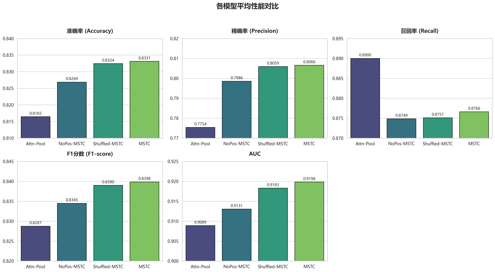

五次独立重复实验的详细结果如图 4-6、4-7、4-8 所示：

**图 4-6 顺序消融实验：不同随机种子下的准确率对比**

<!-- 这是一张图片，ocr 内容为： -->
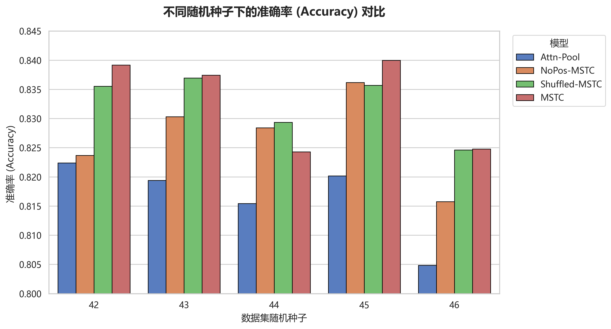

**图 4-7 顺序消融实验：不同随机种子下的 AUC 对比**

<!-- 这是一张图片，ocr 内容为： -->
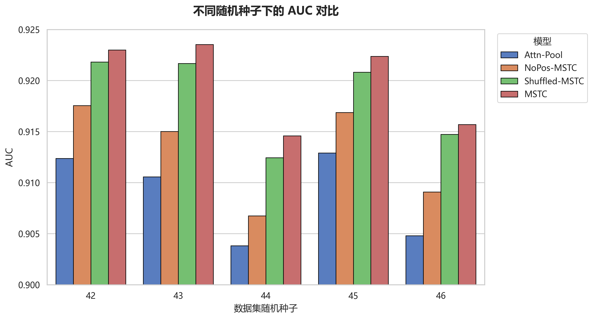

**图 4-8 顺序消融实验：不同随机种子下的 F1-score 对比**

<!-- 这是一张图片，ocr 内容为： -->
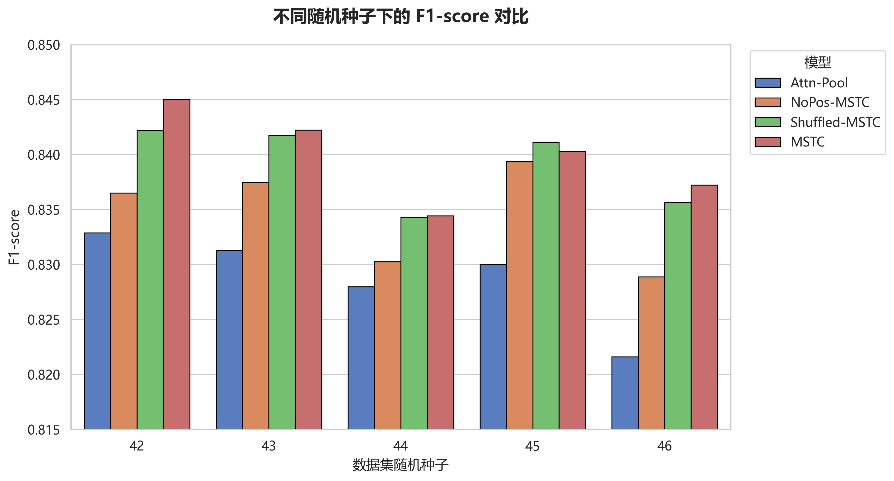

在不同随机种子驱动的绝大多数实验轮次中，MSTC 模型表现最优，各指标与平均性能评估结果高度一致，验证了实验结果的稳健性。

从实验结果可以得到四点与顺序问题直接相关的洞察：

第一，MSTC 模型取得了最优性能，在 AUC、F1-score 和准确率上均领先于其他模型，这说明在统一内容块序列设定下，引入位置编码并使用正确顺序能够带来整体收益。这证明了众筹预测任务不仅取决于发起人说了什么，更取决于其展示的逻辑，图文排列顺序作为内容本身之外的关键变量，对资助者的决策心理具有重要的引导作用。

第二，静态注意力机制在建模叙事逻辑方面存在局限，采用静态注意力池化机制的 Attn-Pool 模型效果不佳，这有力地证明了众筹页面的组织效力并非源于某些关键内容块，而是源于块与块之间动态的叙事交互。相比于简单的加权求和，Transformer 架构所捕捉的长距离依赖特征更契合众筹页面的复杂叙事结构。

第三，真实呈现顺序蕴含着符合认知规律的线性信息。MSTC 相较于 Shuffled-MSTC 的性能提升较小但可复现，这表明真实呈现顺序确实提供了可用的判别信息。虽然提升幅度受限于模型处理窗口的长度，但这一可复现的增益证实了众筹页面存在符合浏览者认知心理的线性叙事规律。一旦真实的图文逻辑序列被置乱，模型对资助者决策行为的模拟精度就会受损，这有力支撑了本研究将分析焦点转向展示逻辑的必要性。 

第四，位置编码本身同样带来收益。实验结果显示，引入了位置编码的 Shuffled-MSTC 明显优于 NoPos-MSTC，说明位置编码的收益并不完全依赖正确顺序；即使在序列置乱的状态下，位置编码依然充当了内容块的“空间指纹”，赋予了模型区分不同位置块属性的能力，从而学到更丰富的跨模态交互模式。

### 4.4.2 视觉密度价值
本文认为，在众筹场景下，除了项目叙事内容本身，图文视觉密度也是影响用户感知与决策的关键因素。文字的冗长程度、图片的视觉占比等等，直接决定着潜在投资者的认知负荷与阅读意愿，本文将这些特征统称为视觉密度属性。

为量化视觉密度属性对预测效果的贡献，本节构建了 NoAttr-MSTC（移除密度属性）与 MSTC（保留完整属性）两种模型进行对比消融实验。两种模型架构完全相同，唯一的变量在于输入端是否保留视觉密度特征向量。

表 4-6 与图 4-9 展示了两种模型的预测性能：

**表 4-6 视觉密度消融实验：五次实验平均性能对比**

| 模型配置 | Accuracy | Precision | Recall | F1-score | AUC |
| --- | --- | --- | --- | --- | --- |
| NoAttr-MSTC | 0.8310 | 0.8022 | **0.8785** | 0.8383 | 0.9193 |
| MSTC | **0.8331** | **0.8066** | 0.8766 | **0.8398** | **0.9198** |

**图 4-9 视觉密度消融实验：五次实验平均性能对比**

<!-- 这是一张图片，ocr 内容为： -->
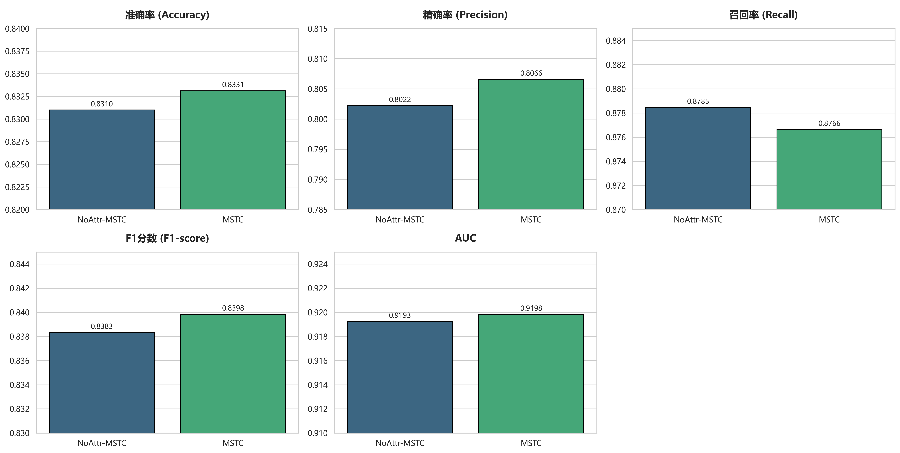

为了进一步验证视觉密度属性带来的增益是否具备统计意义上的稳健性，本文通过图 4-10、4-11 与 4-12 展示了在五次独立重复实验中，两个模型在核心指标上的波动对比： 

**图 4-10 视觉密度消融实验：不同随机种子下的准确率对比**<!-- 这是一张图片，ocr 内容为： -->
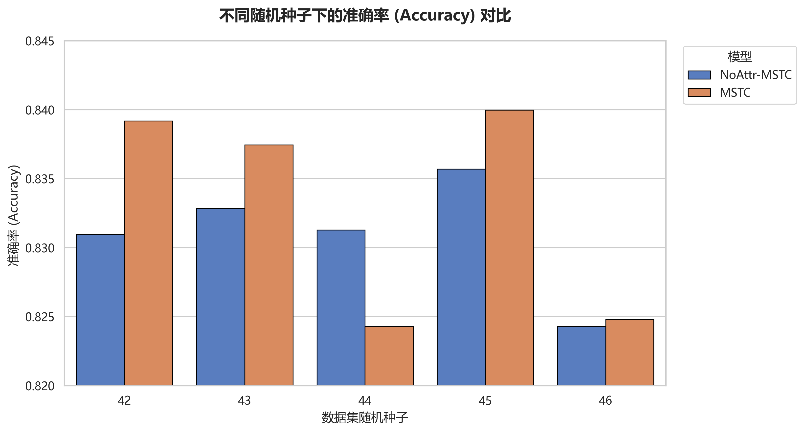

**图 4-11 视觉密度消融实验：不同随机种子下的 AUC 对比**

<!-- 这是一张图片，ocr 内容为： -->
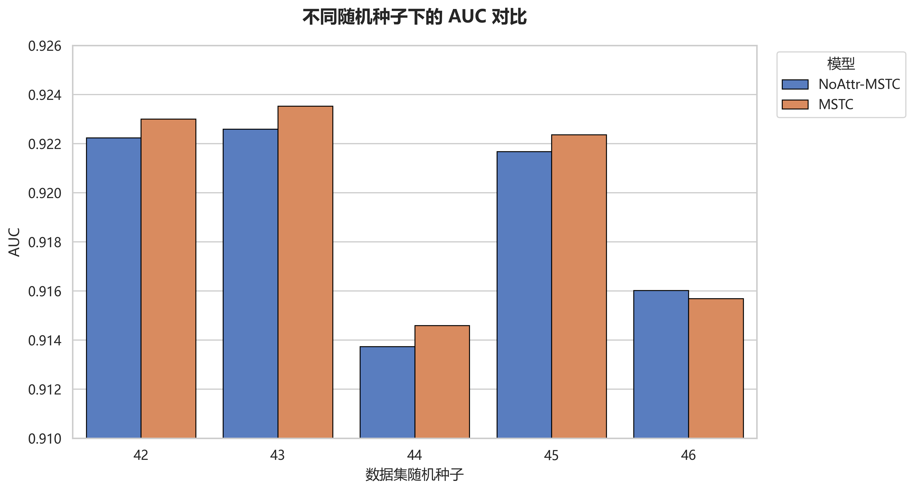

**图 4-12 视觉密度消融实验：不同随机种子下的 F1-score 对比**

<!-- 这是一张图片，ocr 内容为： -->
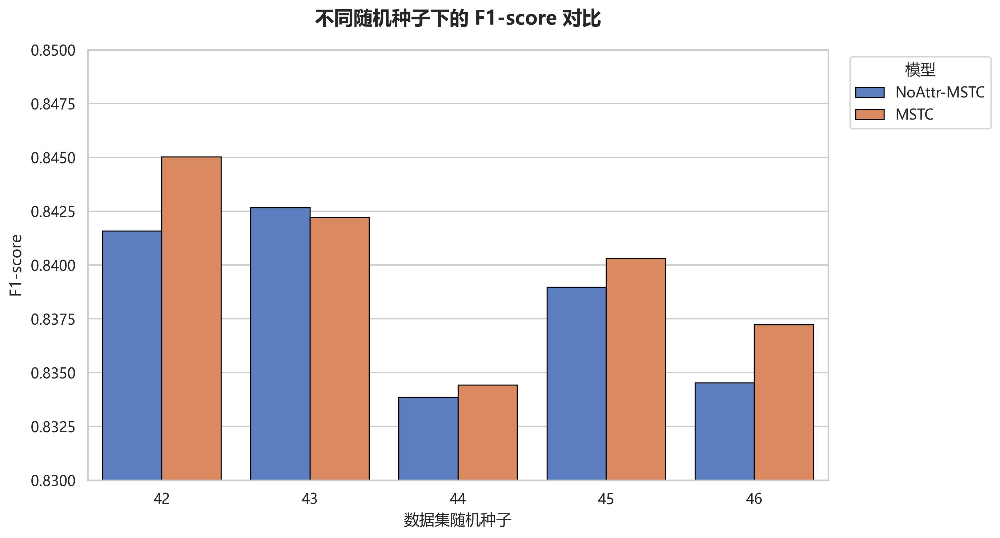

实验结果显示，全量属性的 MSTC 模型在 Accuracy、Precision 和 F1-score 上均优于 NoAttr-MSTC。尽管受限于预训练模型本身已具备极强的表征能力，加入视觉密度属性在数值上的绝对增幅较小，但在不同随机种子（42-46）的测试轮次中，该增益表现出了高度的稳定性。这种跨实验的一致性有力地排除了指标提升源于随机偏差的可能性，证实了视觉密度特征对于提升预测精度的真实边际贡献。

尽管 MSTC 模型在大多数实验轮次中展现出明显的优势，但在随机种子为 44 的特定数据划分下，该模型的表现出现了轻微下滑，甚至略低于未引入视觉密度属性的 NoAttr-MSTC。针对这一现象，本文认为存在以下两点潜在原因：

首先，引入视觉密度属性虽然扩充了模型的输入信息，但也相应地增加了特征空间的维度与复杂度。在种子 44 所对应的特定样本分布中，部分项目的视觉排版特征（如极端的文字长度或图片占比）可能与项目真实的成功标签之间存在噪声干扰。MSTC 模型在学习过程中可能过度拟合了这些非普适性的视觉规律，导致在测试集上的泛化能力受到局部削弱。

其次， 在众筹成功预测任务中，内容的语义表征始终占据主导地位。在某些特定数据子集中，若内容的语义信号与视觉密度信号呈现出不一致的指向，模型对辅助特征的关注可能会在一定程度上干扰对核心语义的准确判断。

然而从全局视角来看，此类性能回调仅属于偶发性的局部波动。MSTC 在其余多数轮次中的稳定领先地位表明，视觉密度属性在统计意义上能够提供正向的判别增益。这种在特定随机划分下的性能震荡，也反映出未来在融合多维特征时，需要在项目筛选和特征工程上做更精细的工作，以规避在极端数据分布下的过拟合风险。

综上所述，实验结果验证了本文的理论假设，即模型通过 Transformer 的注意力机制，成功捕捉到了内容语义与页面视觉密度节奏之间的深层交互。这种对叙事传输过程的数字化模拟，使得模型能够更精准地识别出那些内容充实、排版符合投资者认知加工习惯的成功项目。

## 4.5 本章小结
本章通过一系列对比实验与消融实验，对本文提出的序列化建模范式（MSTC）进行了全方位的性能评估。在已完成的对比实验中，MSTC 模型在 Accuracy、F1-score 以及 AUC 等核心评价指标上均显著优于传统的无序集合、卷积融合及晚期融合范式，体现出以下优势：

(1) 早期融合的优越性：本研究提出的统一序列范式优于传统的晚期融合范式，说明跨模态 Token 级交互与统一序列组织方式能够带来额外收益，在特征提取早期进行图文融合能有效减少语义信息在压缩过程中的损失。

(2) 宏观结构的预测效力：作为任务级参考的 MDL 模型连接了本研究与既有成果。Late-MSTC 与 MSTC 模型的表现普遍优于仅提取局部特征的 MDL 卷积模型，说明在众筹项目评估中，页面内容的宏观结构比局部的视觉或文本模式包含更强的预测信号，进一步验证了本文方法相对传统方法的优势。

(3) 决策稳健性与平衡性：在所有对比实验中，MSTC 模型的 Precision 与 Recall 最为均衡。相比之下，部分基准模型虽在 Recall 上表现尚可，但 Precision 较低。MSTC 范式通过对图文序列的深度对齐，有效缓解了 Precision 与 Recall 之间的权衡冲突，从而实现了最高的 F1 分数。这证明了序列化建模在处理众筹数据这种高噪声场景时，具有更强的鲁棒性和判别准确度。

针对顺序信息的消融实验进一步深化了上述结论。通过构建反事实场景，本文证实了图文排列顺序所表征的叙事逻辑是影响众筹成败的关键变量。位置编码相对无位置的容量对照有明显收益，正确呈现顺序相对置乱顺序带来小幅但可复现的提升，说明正确的位置信息存在增益。这有力支撑了本研究的假设：众筹页面存在符合资助者认知心理的线性叙事规律，人为破坏这种逻辑一致性会导致模型预测精度的下降。

最后，针对视觉密度属性的消融实验表明，在深度学习模型捕获复杂语义特征的基础上，引入文本长度和图片尺寸等视觉密度属性信息仍能带来稳健的性能增益，量化地证明了视觉密度对众筹成功性的影响。 

# 第 5 章 总结与展望
## 5.1 研究总结
本文针对奖励型众筹项目成功性预测这一核心问题，突破了传统研究仅关注内容语义的局限性，创新性地引入了内容呈现结构这一维度，构建了基于统一序列建模范式的多模态深度学习模型，并在 Kickstarter 真实数据集上进行了实验验证。现将本研究的核心内容总结如下：

首先，本研究立足叙事传输理论，设计了基于统一序列建模范式的多模态深度学习模型 MSTC，实现了对众筹界面内容呈现结构这一维度的量化建模。该模型摒弃了传统研究中将模态视为孤立集合的局限，利用 HTML DOM 树解析技术还原页面真实的物理展示顺序。在底层表征上，模型中的 Token 编码器融合了 CLIP 语义嵌入、区分不同模态的类型向量和表征认知负荷的视觉密度属性，实现了对内容块的多维信息封装。通过正弦位置编码的注入，Token 序列被赋予了感知真实页面浏览顺序的能力，进而使得 Transformer 序列编码器可以利用多头自注意力机制模拟读者认知行为，捕捉图文交织中所蕴含的叙事逻辑与视觉节奏。为了提升模型在众筹数据高噪声、分布不均等复杂场景下的性能，本研究系统性地应用了标签平滑、指数滑动平均（EMA）以及动态阈值寻优等一系列稳健性策略，显著增强了预测结果的泛化能力与评估稳定性。

其次，基于 Kickstarter 真实数据集的实验结果证明，统一序列建模范式在众筹结果预测任务上具有显著优越性。在与多种主流多模态融合范式的对比中，本文提出的 MSTC 模型在准确率、F1 分数以及 AUC 等核心指标上均表现最优，且在精确率与召回率之间取得了最佳平衡。这种性能增益源于模型 Token 级的深度跨模态交互，该机制允许模型在特征提取早期捕获图文间的深层对齐关系，最大限度地减少了特征压缩过程中的语义损失。消融实验结果进一步支持了本文的核心假设，即图文内容呈现结构是影响众筹成败的关键判别变量，众筹页面吸引潜在投资者的能力不仅源于发起人“说了什么”，更取决于发起人“是如何说的”。消融实验显示，引入正弦位置编码并遵循众筹页面中真实的图文展示顺序，能为模型带来显著且可复现的性能增益；视觉密度特征是语义信息之外的重要补充，能够稳定提升模型对复杂页面信息的判别能力。

综上所述，本研究不仅提升了深度学习模型进行众筹成功性预测的性能，更从实证角度揭示了图文内容呈现结构在奖励式众筹这一金融模式中的重要地位，为平台优化资源配置和发起人改进项目设计提供了科学的决策依据。

## 5.2 理论贡献
本研究对众筹页面多模态内容呈现结构进行建模，不仅在技术层面提升了预测性能，更在理论层面深化了对众筹交互机制的理解。 

这种理解的深化，首先源于对众筹内容呈现结构信号作用的挖掘。不同于以往研究多关注发起人背景及图文内容质量，本研究通过实验发现，页面内容的呈现形式本身也是反映众筹项目质量的关键判别信号。在奖励型众筹这种典型的信息不对称场景下，一套有序、严谨且符合逻辑的内容结构，反映了发起人在项目策划上的投入程度与专业性，进而影响了潜在投资者的出资意愿。这一发现拓展了众筹结果预测领域特征选择的边界，打破了过往研究只关注内容而不关注结构的局限性，为众筹项目质量评估提供了新视角。

而在探究结构如何发挥作用的过程中，本研究为叙事传输理论提供了计算层面的工程实证方案，实现了从理论驱动到工程实践的闭环。这种闭环的建立源于对叙事传输质量在计算维度的建模：高质量的众筹界面不仅在顺序上需要有严谨的递进逻辑，同时在密度上需要保持具有呼吸感的叙述节奏。通过构建深度学习模型 MSTC，本研究量化了图文序列的叙事逻辑和视觉密度，通过消融实验证明了遵循真实展示顺序的序列建模能显著提升预测性能、视觉密度特征也能通过量化认知负荷实现稳健的判别增益。这一结果在计算层面有力地支撑了叙事传输机理在信息传播与说服过程中的核心地位。

本研究模型的有效性，进一步验证了图文统一建模在模拟人类认知过程中的独特价值。基于双重编码理论，文字语义与视觉呈现之间存在深层的协同关系。本研究在实证层面证实了将文字与图片纳入统一序列进行特征融合的必要性，认为该方案比传统的模态割裂建模更符合人类处理交替信息的认知规律。对比实验表明，通过使用 Transformer 编码器在 Token 级别实现图文的深度交互，模型在预测性能上超越了晚期融合模型和卷积神经网络模型，强调了图文统一建模在复杂内容理解中的作用。

## 5.3 局限性与未来方向
虽然本研究成功在众筹成功性预测中引入了内容呈现结构，验证了该方案的有效性，但由于时间、数据及计算资源的限制，仍存在以下局限，同时也为未来的深入研究指明了方向。

第一，未来研究可以涵盖视频模态。当前研究主要聚焦于图文交织的界面布局结构，未考虑视频模态，主要原因在于：在实际的众筹决策场景中，长达数分钟的项目视频虽然能提供丰富的感官信息，但其信息获取成本远高于图文阅读。大量投资者倾向于通过快速滑动页面来获取项目的关键信息，而非完整观看视频。然而不可忽视的是，视频往往位于项目封面等核心位置，其动态演示具有极强的感染力，现已有部分研究将视频模态引入深度学习预测模型并取得了良好成效。未来的研究中可以尝试提取视频关键帧进行语义理解和情感分析，将其作为特殊的视觉 Token 整合进统一序列框架中。 

第二，跨平台泛化性有待验证。本研究的实验数据集仅来源于 Kickstarter 平台，虽然其作为全球最大的奖励型众筹平台具有代表性，但在平台规则、用户画像及审美倾向方面可能存在特定偏好。考虑到不同平台的叙事风格可能存在差异，不同国家的众筹平台也可能存在不同的用户群体，未来可以将模型迁移至其他国内外众筹平台（如 Indiegogo 等），验证基于内容呈现逻辑的模型在不同平台上的泛化能力，提升模型的通用性。

第三，多模态特征提取的精细度仍可提升。目前模型主要依赖 CLIP 模型提取的语义特征和基于物理属性的视觉密度，这种建模方式虽然高效，但存在特征提取不够细腻的问题。首先，众筹场景下的图文语义分布可能和 CLIP 预训练时所使用的图像及文本存在差异，未来研究可尝试使用众筹领域特有的图文数据对 CLIP 进行微调，使模型能够学习到众筹场景下的专业词汇与视觉逻辑，从而提取更具判别力的语义特征。其次，除图文语义信息之外，图文的质量属性也是叙事质量的重要组成部分。未来可引入专业的美学评估模型量化图像的视觉吸引力指标，也可利用大语言模型对文本质量（如流畅度、可读性等）进行深度评估，更全面地刻画众筹项目的叙事质量。

# 参考文献
[1] Mitra T, Gilbert E. The language that gets people to give: Phrases that predict success on kickstarter[C]//Proceedings of the 17th ACM conference on Computer suppofrted cooperative work & social computing. 2014: 49-61.

[2] Yuan H, Lau R Y K, Xu W. The determinants of crowdfunding success: A semantic text analytics approach[J]. Decision Support Systems, 2016, 91: 67-76.

[3] Popescul D, Radu L D, Păvăloaia V D, et al. Psychological determinants of investor motivation in social media-based crowdfunding projects: A systematic review[J]. Frontiers in Psychology, 2020, 11: 588121.

[4] Mollick E. The dynamics of crowdfunding: An exploratory study[J]. Journal of business venturing, 2014, 29(1): 1-16.

[5] Pekar V, Candi M, Beltagui A, et al. Explainable text-based features in predictive models of crowdfunding campaigns[J]. Annals of Operations Research, 2025, 354(1): 367-397.

[6] Ardakani S P, Hu J, Zhang J, et al. Identifying crowdfunding storytellers who deliver successful projects: a machine learning approach[J]. J. Supercomput., 2025, 81(1): 263.

[7] Zhang X, Lyu H, Luo J. What contributes to a crowdfunding campaign's success? Evidence and analyses from GoFundMe data[J]. Journal of Social Computing, 2021, 2(2): 183-192.

[8] Zhang X, Zheng X, Luo J. The influence of stereotypes and visual features on donation intentions in online medical crowdfunding campaigns: A comparison of survey and large language model-based methods[J]. npj Artificial Intelligence, 2025, 1(1): 16.

[9] Greenberg M D, Pardo B, Hariharan K, et al. Crowdfunding support tools: predicting success & failure[M]//CHI'13 extended abstracts on human factors in computing systems. 2013: 1815-1820.

[10] Li Y, Rakesh V, Reddy C K. Project success prediction in crowdfunding environments[C]//Proceedings of the ninth ACM international conference on web search and data mining. 2016: 247-256.

[11] Yuan H, Lau R Y K, Xu W. The determinants of crowdfunding success: A semantic text analytics approach[J]. Decision Support Systems, 2016, 91: 67-76.

[12] Kaminski J C, Hopp C. Predicting outcomes in crowdfunding campaigns with textual, visual, and linguistic signals[J]. Small Business Economics, 2020, 55(3): 627-649.

[13] Cheng C, Tan F, Hou X, et al. Success Prediction on Crowdfunding with Multimodal Deep Learning[C]//IJCAI. 2019: 2158-2164.

[14] Tang Z, Yang Y, Li W, et al. Deep cross-attention network for crowdfunding success prediction[J]. IEEE Transactions on Multimedia, 2022, 25: 1306-1319.

[15] Cai Z, Ding H, Xu M, et al. Multimodal dynamic graph convolutional network for crowdfunding success prediction[J]. Applied Soft Computing, 2024, 154: 111313.

[16] Li J, Xu X, Li Y, et al. Commonality Augmented Disentanglement for Multimodal Crowdfunding Success Prediction[C]//ICASSP 2025-2025 IEEE International Conference on Acoustics, Speech and Signal Processing (ICASSP). IEEE, 2025: 1-5.

[17] Kao T W, Hsiao S H, Su H C, et al. Deriving execution effectiveness of crowdfunding projects from the fundraiser network[J]. Journal of Management Information Systems, 2022, 39(1): 276-301.

[18] 李清香,王念新,吕爽,等.发起人与出资者的在线交互对众筹项目成功的影响[J].管理工程学报,2020,34(01):118-126.

[19] 王念新,吕爽,周园,等.连续发起人的经验对众筹成功的影响:经验相关性的调节效应分析[J].管理工程学报,2020,34(04):89-100.

[20] Carradini S, Fleischmann C. The effects of multimodal elements on success in Kickstarter crowdfunding campaigns[J]. Journal of Business and Technical Communication, 2023, 37(1): 1-27.

[21] Raab M, Schlauderer S, Overhage S, et al. More than a feeling: Investigating the contagious effect of facial emotional expressions on investment decisions in reward-based crowdfunding[J]. Decision Support Systems, 2020, 135: 113326.

[22] Costello F J, Lee K C. Exploring investors' expectancies and its impact on project funding success likelihood in crowdfunding by using text analytics and Bayesian networks[J]. Decision Support Systems, 2022, 154: 113695.

[23] Chen S, Wang H, Fang Y, et al. Informational and emotional appeals of cover image in crowdfunding platforms and the moderating role of campaign outputs[J]. Decision Support Systems, 2023, 171: 113975.

[24] Song C, Luo J, Hölttä-Otto K, et al. Crowdfunding for design innovation: prediction model with critical factors[J]. IEEE Transactions on Engineering Management, 2020, 69(4): 1565-1576.

[25] Bao L, Wang Z, Zhao H. Who said what: Mining semantic features for success prediction in reward-based crowdfunding[J]. Electronic Commerce Research and Applications, 2022, 53: 101156.

[26] Blanchard S J, Noseworthy T J, Pancer E, et al. Extraction of visual information to predict crowdfunding success[J]. Production and Operations Management, 2023, 32(12): 4172-4189.

[27] 徐琳.多模态数据驱动的众筹项目成功率预测研究[D].合肥工业大学,2022.

[28] Al-Qershi O M, Kwon J, Zhao S, et al. Predicting crowdfunding success with visuals and speech in video ads and text ads[J]. European Journal of Marketing, 2022, 56(6): 1610-1649.

[29] Zhang Z, Lau R Y K. Exploiting multimodal features and deep learning for predicting crowdfunding successes[C]//2024 IEEE International Conference on Omni-layer Intelligent Systems (COINS). IEEE, 2024: 1-6.

[30] Sweller J. Cognitive load theory[M]//Psychology of learning and motivation. Academic Press, 2011, 55: 37-76.

[31] 何旭, 郭春彦. 视觉工作记忆的容量与资源分配[J]. 心理科学进展, 2013, 21(10): 1741.

[32] 车敬上, 孙海龙, 肖晨洁, 等. 为什么信息超载损害决策? 基于有限认知资源的解释[J]. 心理科学进展, 2019, 27(10): 1758-1768.

[33] Djamasbi S, Siegel M, Tullis T. Visual hierarchy and viewing behavior: An eye tracking study[C]//International conference on human-computer interaction. Berlin, Heidelberg: Springer Berlin Heidelberg, 2011: 331-340.

[34] Liang X, Hu X, Jiang J. Research on the effects of information description on crowdfunding success within a sustainable economy—the perspective of information communication[J]. Sustainability, 2020, 12(2): 650.

[35] Alter A L, Oppenheimer D M. Uniting the tribes of fluency to form a metacognitive nation[J]. Personality and social psychology review, 2009, 13(3): 219-235.

[36] Hogarth R M, Einhorn H J. Order effects in belief updating: The belief-adjustment model[J]. Cognitive psychology, 1992, 24(1): 1-55.

[37] Joshi A, Mathur G. The inverted pyramid approach in user interface design for interactive information retrieval[C]//Proceedings of the EASY3 (CHI South India) Annual Conference. CiteSeerX. 2004.

[38] Tjärnhage A, Söderström U, Norberg O, et al. The impact of scrollytelling on the reading experience of long-form journalism[C]//Proceedings of the European Conference on Cognitive Ergonomics 2023. 2023: 1-9.

[39] Lee J E, Shin E, Kincade D H. The Effects of Presentation Order of Apparel Product Images on Consumers’ Information Processing Style and Purchase Intentions[C]//International Textile and Apparel Association Annual Conference Proceedings. Iowa State University Digital Press, 2019, 76(1).

[40] Lee J E, Shin E, Kincade D H. Presentation-Order Effect of Product Images on Consumers’ Evaluations in Online Shopping[C]//International Textile and Apparel Association Annual Conference Proceedings. Iowa State University Digital Press, 2020, 77(1).

[41] Razak N A, Asma’Amran S N. Effective language use in advertising in the most visible online stores: 2 Case Studies[J]. International Journal of Education and Learning Systems, 2017, 2: 30-38.

[42] Green M C, Brock T C. The role of transportation in the persuasiveness of public narratives[J]. Journal of personality and social psychology, 2000, 79(5): 701.

[43] Xu Y, Li M, Cui L, et al. Layoutlm: Pre-training of text and layout for document image understanding[C]//Proceedings of the 26th ACM SIGKDD international conference on knowledge discovery & data mining. 2020: 1192-1200.

[44] Xu Y, Xu Y, Lv T, et al. Layoutlmv2: Multi-modal pre-training for visually-rich document understanding[C]//Proceedings of the 59th Annual Meeting of the Association for Computational Linguistics and the 11th International Joint Conference on Natural Language Processing (Volume 1: Long Papers). 2021: 2579-2591.

[45] Cui X, Lu W, Tong Y, et al. Diffusion-based multi-modal synergy interest network for click-through rate prediction[C]//Proceedings of the 48th International ACM SIGIR Conference on Research and Development in Information Retrieval. 2025: 581-591.

[46] Paivio A. Mental representations: A dual coding approach[M]. Oxford university press, 1990.

[47] Radford A, Kim J W, Hallacy C, et al. Learning transferable visual models from natural language supervision[C]//International conference on machine learning. PmLR, 2021: 8748-8763.

[48] 刘婷, 侯文军. 基于视觉行为的手机新闻 App 图文布局设计研究[J]. 北京邮电大学学报 (社会科学版), 2016, 18(3): 6.

[49] Chai S, Chang Y, Li Y. Image-Left, Text-Right: The Horizontal Sequence Effect of Images and Text on Consumer Responses to in-Feed News[J]. Psychology & Marketing, 2025.

[50] Kaminski J C, Hopp C. Predicting outcomes in crowdfunding campaigns with textual, visual, and linguistic signals[J]. Small Business Economics, 2020, 55(3): 627-649.

# 致谢
又是一年毕业季，只是今年毕业的主角变成了我自己。在硕士生涯即将画上句号之际，我想对所有帮助过我的人致以最真诚的感谢。

首先，特别感谢我的导师许伟教授。 感谢许老师一直以来对我的栽培，从大四那年提前带我进入课题组学习，到如今指导我完成硕士毕业论文，这几年的学术引导让我受益终身。 在毕业论文撰写过程中，许老师每一次耐心的辅导与思路的点拨，总能让我豁然开朗。人们常说良师是智慧的灯塔，谢谢您一直以来的教诲，祝愿您身体健康，家庭幸福，工作顺利！

其次，我要感谢一直以来支持着我的家人。感谢我的家人，没有你们在背后的坚定支持，就不会有我今天的小小成就。如今我即将真正踏入社会，身上又多了一份作为成年人的责任，希望在不久的未来，我也能拥有保护和支持你们的力量。

同时，也感谢这两年来在中国人民大学结识的同门与朋友们。尤其感谢指导我进行众筹相关科研的杨少辰师兄。在论文撰写及模型调试过程中，师兄总是不吝赐教，耐心与我讨论并分享经验，让这篇论文得以更加严谨地呈现。尽管硕士生活只有匆匆两年，但与你们在校园里的交流与共处，构成了我生命中极为珍贵的记忆。此后天南海北，愿大家都能在各自的领域熠熠生辉。 

最后，感谢中国人民大学给予我的培养。尽管即将告别校园走向新的岗位，但人大带给我的眼界、底气与情怀将伴随我一生。旧章落幕，新篇开启。祝愿母校年华常青，更上一层楼！
